# Architecture Overview

scan3data is built as a multi-crate Rust workspace with strong separation of concerns and pluggable deployment modes.

## Table of Contents

- [Multi-Crate Workspace](#multi-crate-workspace)
- [Component Architecture](#component-architecture)
- [Canonical Intermediate Representation (CIR)](#canonical-intermediate-representation-cir)
- [Deployment Modes](#deployment-modes)
- [Technology Stack](#technology-stack)
- [Design Principles](#design-principles)

## Multi-Crate Workspace

scan3data is organized as 5 interconnected Rust crates within a Cargo workspace:

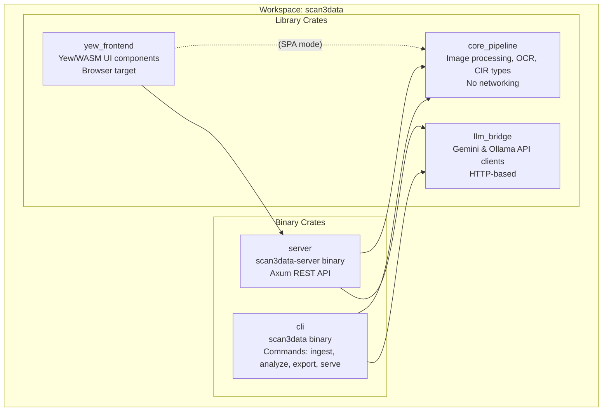

### Crate Responsibilities

| Crate | Type | Responsibility | Key Dependencies |
|-------|------|---------------|------------------|
| **core_pipeline** | Library | Core types (CIR), image preprocessing, OCR integration, IBM 1130 decoder | image, imageproc, leptess, serde |
| **llm_bridge** | Library | Gemini API client, Ollama API client, prompt templates | reqwest, base64, serde_json |
| **cli** | Binary | Command-line interface with ingest/analyze/export/serve commands | clap, core_pipeline, llm_bridge |
| **server** | Binary | Axum REST API server, static file serving | axum, tokio, tower-http, core_pipeline |
| **yew_frontend** | Library | Yew/WASM UI with 4-stage pipeline visualization | yew, wasm-bindgen, gloo, web-sys |

## Component Architecture

### High-Level Component Diagram

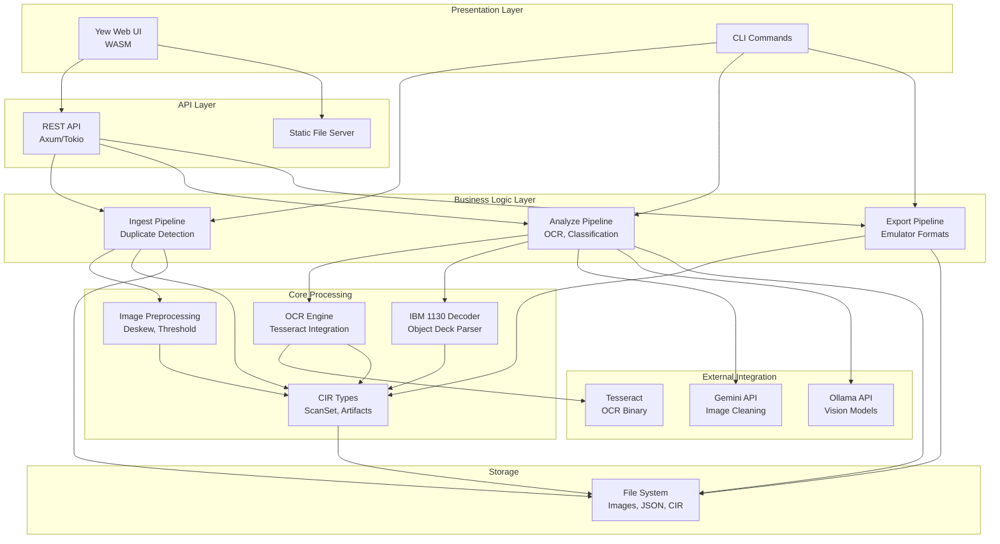

### Component Interaction Details

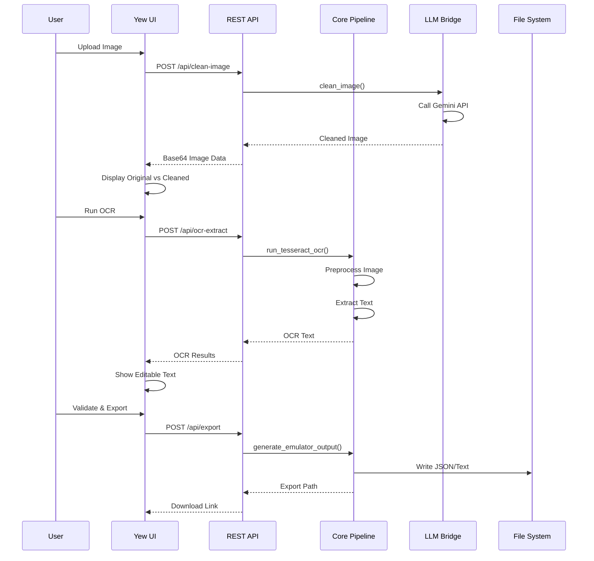

## Canonical Intermediate Representation (CIR)

The CIR is the central data structure that flows through the pipeline. It provides a unified representation for all processing stages.

### CIR Type Hierarchy

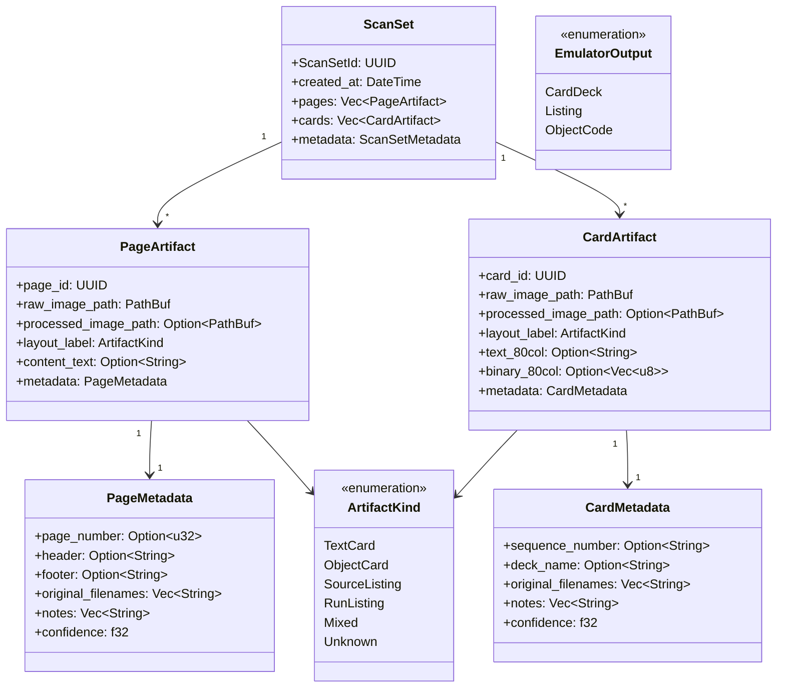

### CIR Data Flow

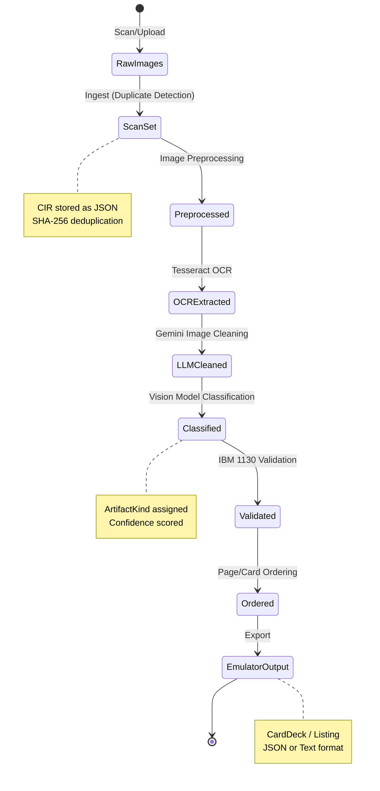

## Deployment Modes

scan3data supports three deployment modes to suit different use cases:

### Mode 1: CLI-Only (Batch Processing)

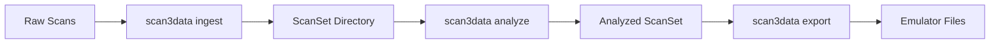

**Use Cases:**
- Batch processing large collections
- CI/CD pipelines
- Server-side automation
- No GUI needed

**Commands:**
```bash
scan3data ingest -i ./scans -o ./scan_set_001
scan3data analyze -s ./scan_set_001
scan3data export -s ./scan_set_001 -o output.json
```

### Mode 2: Standalone SPA

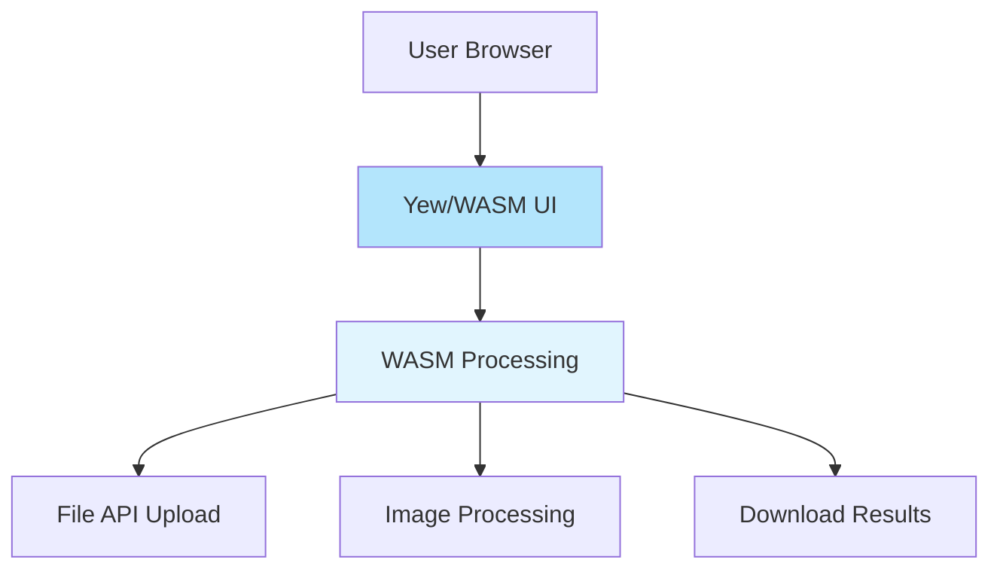

**Use Cases:**
- Offline usage
- No server setup required
- Privacy-sensitive (all processing local)
- Demos and prototyping

**Serving:**
```bash
./scripts/serve-spa.sh 8080
# Open http://localhost:8080
```

**Note:** Currently limited - full implementation planned for Phase 3.

### Mode 3: Backend + Frontend (Full Stack)

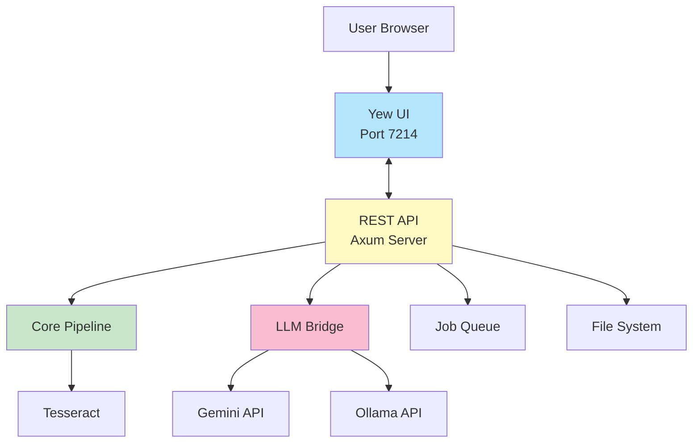

**Use Cases:**
- Production deployment
- LLM integration (Gemini, Ollama)
- Multiple concurrent users
- Heavy processing workloads
- WebSocket progress updates

**Serving:**
```bash
./target/release/scan3data-server
# Backend + UI: http://localhost:7214
```

**Current Implementation:**
- ✅ Static file serving (Yew UI)
- ✅ Gemini API integration (/api/clean-image)
- 🚧 Job queue (planned)
- 🚧 WebSocket progress (planned)
- 🚧 Scan set storage (placeholder)

## Technology Stack

### Frontend Stack

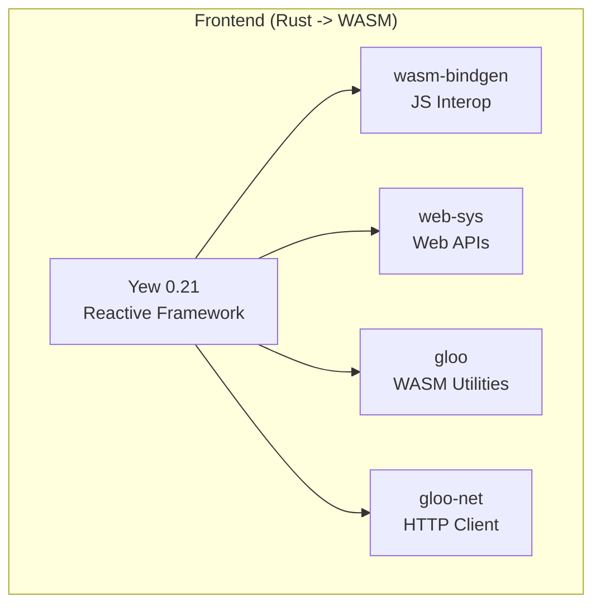

**Build Tool:** Trunk (WASM bundler)
**Target:** wasm32-unknown-unknown

### Backend Stack

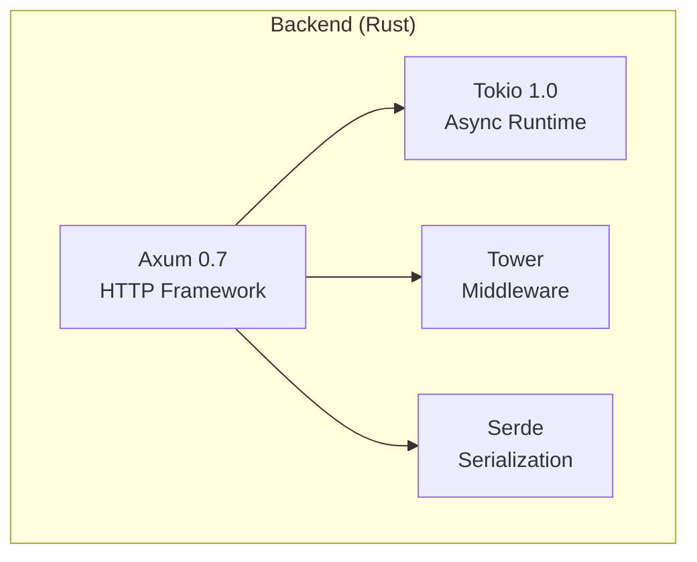

**Runtime:** Tokio async
**Server:** Axum with tower-http

### Core Processing Stack

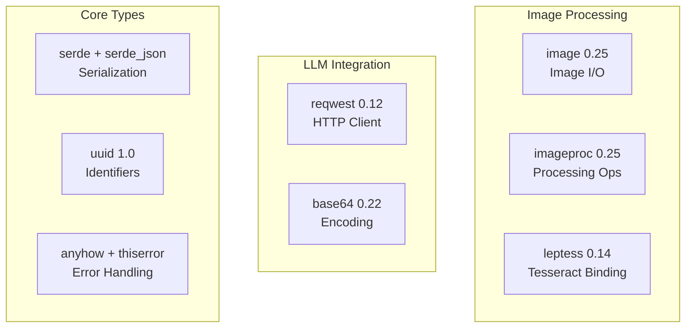

**OCR Engine:** Tesseract (external binary)
**LLM APIs:** Gemini (cloud), Ollama (local)

## Design Principles

### 1. Rust-First Philosophy

**All** business logic, data processing, and presentation code is written in Rust:
- Frontend: Yew (compiles to WASM)
- Backend: Axum (pure Rust HTTP)
- Image Processing: Rust crates
- CLI: Rust (clap)

**Only acceptable non-Rust:**
- Minimal HTML/CSS for UI structure
- External binaries called via `Command::new()` (Tesseract, Ollama)

**Never acceptable:**
- JavaScript/TypeScript for business logic
- Python for image processing
- Node.js for backend

### 2. Separation of Concerns

Each crate has a single, well-defined responsibility:

| Concern | Crate | Dependencies |
|---------|-------|-------------|
| Data types & core processing | core_pipeline | No networking, pure logic |
| External API integration | llm_bridge | HTTP clients only |
| Command-line interface | cli | Uses core_pipeline + llm_bridge |
| Web API | server | Uses core_pipeline + llm_bridge |
| Web UI | yew_frontend | Browser-only, no backend coupling |

### 3. Pluggable Deployment

The architecture supports multiple deployment modes without code changes:
- CLI-only: No web server needed
- SPA: No backend needed (future)
- Full-stack: Complete feature set

This is achieved through:
- Core logic in libraries (not binaries)
- Clean API boundaries between crates
- Configuration-based mode selection

### 4. Test-Driven Development

Every component is designed for testability:
- Pure functions in core_pipeline (no I/O)
- Mock APIs in llm_bridge tests
- Integration tests for CLI commands
- WASM tests for frontend components

**Quality Standards:**
- Zero clippy warnings (`-D warnings`)
- All tests pass before commit
- Red/Green/Refactor TDD cycle

### 5. Canonical Intermediate Representation

All pipeline stages operate on the same CIR:
- Consistent data model across phases
- Easy to serialize/deserialize (JSON)
- Extensible via enums (ArtifactKind, EmulatorOutput)
- Backward-compatible changes

This enables:
- Pipeline checkpointing (save/resume)
- Manual intervention at any stage
- Incremental processing
- Easy debugging

### 6. Progressive Enhancement

The system works in stages of increasing sophistication:

**Phase 1: Baseline (No LLM)**
- Classical image preprocessing
- Tesseract OCR
- Basic heuristics for classification
- ✅ **Status: Complete**

**Phase 2: LLM-Enhanced**
- Gemini image cleaning
- Vision model OCR correction
- Text model classification and ordering
- 🚧 **Status: In Progress**

**Phase 3: Advanced AI**
- Custom IBM 1130 models
- Reverse engineering
- Automated reconstruction
- 📋 **Status: Planned**

Each phase builds on the previous, ensuring a working baseline at all times.

## Extensibility Points

The architecture is designed for easy extension:

### 1. Adding New Image Processing

```rust
// In core_pipeline/src/preprocess.rs
pub fn super_resolution(input: &GrayImage) -> Result<GrayImage> {
    // New preprocessing step
}
```

### 2. Adding New LLM Provider

```rust
// In llm_bridge/src/anthropic.rs
pub struct AnthropicClient {
    api_key: String,
}

impl AnthropicClient {
    pub async fn classify_image(&self, image: &[u8]) -> Result<ArtifactKind> {
        // Call Claude API
    }
}
```

### 3. Adding New Artifact Type

```rust
// In core_pipeline/src/types.rs
pub enum ArtifactKind {
    // Existing variants...
    ForthSource,      // New variant
    FortranListing,   // Another new variant
}
```

### 4. Adding New Export Format

```rust
// In core_pipeline/src/types.rs
pub enum EmulatorOutput {
    // Existing variants...
    BinaryDiskImage {
        tracks: Vec<Track>,
    },
}
```

## Performance Considerations

### Image Processing
- **Multi-threading:** Use rayon for parallel batch operations
- **Caching:** Store preprocessed images to avoid recomputation
- **Incremental:** Process only changed/new images

### LLM Calls
- **Batching:** Group similar images (same deck) for efficiency
- **Caching:** Hash-based cache for LLM responses
- **Fallback:** Local-only mode (Tesseract) when LLMs unavailable

### WASM Size
- **Optimization:** Use wasm-opt for size reduction
- **Code Splitting:** Lazy-load components (future)
- **Selective Features:** Only include needed functionality

### API Performance
- **Async:** Tokio for non-blocking I/O
- **Streaming:** Stream large responses
- **Job Queue:** Offload heavy work to background workers (planned)

## Security Considerations

### Input Validation
- ✅ Image format validation (PNG, JPEG, TIFF)
- 🚧 File size limits (planned)
- 🚧 Filename sanitization (planned)

### LLM Safety
- ✅ Never allow LLM to modify binary data directly
- ✅ Always validate LLM JSON outputs
- ✅ Flag low-confidence results for review

### API Security
- 🚧 Rate limiting (planned)
- ✅ CORS configuration (permissive for dev, needs prod config)
- 🚧 Authentication (planned for multi-user)

## Related Pages

- [Data Flow](Data-Flow) - Detailed pipeline flows and sequence diagrams
- [Core Pipeline](Core-Pipeline) - Image processing and OCR details
- [LLM Bridge](LLM-Bridge) - Gemini and Ollama integration
- [REST API](REST-API) - API endpoint documentation
- [Web UI](Web-UI) - Yew frontend architecture
- [CLI](CLI) - Command-line interface documentation

---

**Last Updated:** 2025-11-16
**Architecture Version:** 1.0
