# Contributing to scan3data

Guide for developers contributing to scan3data. Covers workflow, quality standards, and best practices.

## Getting Started

### Fork and Clone

```bash
# Fork repository on GitHub
# Then clone your fork
git clone https://github.com/YOUR_USERNAME/scan3data
cd scan3data

# Add upstream remote
git remote add upstream https://github.com/softwarewrighter/scan3data
```

### Setup Development Environment

```bash
# Install Rust and dependencies (see Building page)
curl --proto '=https' --tlsv1.2 -sSf https://sh.rustup.rs | sh
rustup target add wasm32-unknown-unknown
cargo install trunk

# macOS
brew install tesseract pkgconf

# Linux
sudo apt-get install tesseract-ocr libtesseract-dev

# Install development tools
cargo install cargo-watch
cargo install cargo-tarpaulin  # For coverage
```

### Verify Setup

```bash
# Build all components
./scripts/build-all.sh

# Run tests
cargo test --workspace

# Check linting
cargo clippy --all-targets --all-features -- -D warnings

# Check formatting
cargo fmt --check
```

## Development Workflow

### Test-Driven Development (TDD)

scan3data strictly follows **Red/Green/Refactor** cycle:

```mermaid
graph LR
    RED[🔴 RED<br/>Write failing test] --> GREEN[🟢 GREEN<br/>Write minimal code]
    GREEN --> REFACTOR[🔵 REFACTOR<br/>Improve code]
    REFACTOR --> RED

    style RED fill:#ffcdd2
    style GREEN fill:#c8e6c9
    style REFACTOR fill:#bbdefb
```



### Step-by-Step Example

**1. RED - Write Failing Test**

```rust
// In core_pipeline/src/preprocess.rs
#[cfg(test)]
mod tests {
    #[test]
    fn test_contrast_enhancement() {
        let img = create_low_contrast_image();
        let enhanced = enhance_contrast(&img);

        // Test fails - function doesn't exist yet
        assert!(has_higher_contrast(&enhanced, &img));
    }
}
```

**2. GREEN - Make It Pass**

```rust
// Minimal implementation
pub fn enhance_contrast(img: &GrayImage) -> GrayImage {
    // Simple contrast stretch
    imageproc::contrast::stretch_contrast(img, 0, 255)
}
```

**3. REFACTOR - Improve**

```rust
// Better implementation with histogram equalization
pub fn enhance_contrast(img: &GrayImage) -> GrayImage {
    let histogram = compute_histogram(img);
    equalize_histogram(img, &histogram)
}
```

## Quality Standards

### Zero Warnings Policy

**ALL** clippy warnings must be fixed before commit:

```bash
cargo clippy --all-targets --all-features -- -D warnings
```

**Never use:**
- `#[allow(clippy::...)]` to suppress warnings
- `#[allow(dead_code)]` or `#[allow(unused_variables)]`

**Instead:** Fix the root cause.

### Code Formatting

All code must be formatted with `rustfmt`:

```bash
# Format all code
cargo fmt --all

# Check formatting (CI uses this)
cargo fmt --check
```

**Configuration:** Use project's `.rustfmt.toml` (default settings).

### File Size Limits

- **Source files:** < 500 lines (prefer 200-300)
- **Functions:** < 50 lines (prefer 10-30)
- **Cyclomatic complexity:** < 10

**If exceeding:** Split into multiple modules/functions.

### TODO Management

- **Maximum:** 3 TODOs per file
- **Format:** `// TODO(username): Description + issue link`
- **Deadline:** Address within 2 development sessions
- **Persistent TODOs:** Convert to GitHub issues

```rust
// ✅ Good
// TODO(alice): Implement caching for OCR results - see issue #42

// ❌ Bad
// TODO: fix this later
// FIXME: broken
```

**Never commit FIXMEs** - they indicate known bugs that must be fixed.

## Mandatory Pre-Commit Process

**CRITICAL:** Complete ALL steps before every commit. No exceptions.

### Step 1: Run Tests

```bash
cargo test --workspace
```

**Requirement:** ALL tests must pass.

### Step 2: Fix Linting

```bash
cargo clippy --all-targets --all-features -- -D warnings
```

**Requirement:** ZERO warnings. Re-run until clean.

### Step 3: Format Code

```bash
cargo fmt --all
```

**Verification:**
```bash
cargo fmt --check  # Should output nothing
```

### Step 4: Validate Markdown (if docs changed)

```bash
markdown-checker -f "**/*.md"
```

**Requirements:**
- ASCII-only characters (no Unicode)
- No emojis
- Use `--fix` for auto-fixable issues (tree symbols)

### Step 5: Update Documentation

If issues were found in previous steps:
- Update `docs/learnings.md` with root cause analysis
- Update `README.md` if features changed
- Update `CLAUDE.md` if development patterns changed

## Commit Message Format

```
type: Short summary (50 chars max)

Detailed explanation of what changed and why.
Include context, rationale, and trade-offs.

If bugs were fixed:
- Root cause: <why the bug occurred>
- Prevention: <what process change prevents this>
- Updated learnings.md with <specific section>

[AI] Generated with [Claude Code](https://claude.com/claude-code)

Co-Authored-By: Claude <noreply@anthropic.com>
```

**Types:** `feat`, `fix`, `docs`, `style`, `refactor`, `test`, `chore`

**Examples:**

```
feat: Add SHA-256 duplicate detection for image ingest

Implements duplicate detection using SHA-256 hashing during
the ingest phase. When duplicates are found, store only one
copy and track all original filenames in metadata.

This saves disk space and provides context hints for LLMs.

[AI] Generated with [Claude Code](https://claude.com/claude-code)
```

```
fix: Correct Tesseract character whitelist for IBM 1130

Root cause: Included lowercase letters which don't exist
in IBM 1130 output, causing OCR confusion.

Prevention: Added test with uppercase-only validation.

Updated learnings.md with "OCR Configuration" section.
```

## Pull Request Process

### Creating a Pull Request

1. **Create feature branch**

```bash
git checkout -b feature/add-image-caching
```

2. **Make changes following TDD**

```bash
# Write tests
# Implement feature
# Run pre-commit checks
```

3. **Commit with proper message**

```bash
git add .
git commit  # Write detailed message
```

4. **Push to your fork**

```bash
git push origin feature/add-image-caching
```

5. **Create PR on GitHub**
- Use descriptive title
- Fill out PR template
- Link related issues
- Request review

### PR Requirements

- ✅ All CI checks passing
- ✅ Tests cover new code (≥80% coverage)
- ✅ Documentation updated
- ✅ Changelog entry added
- ✅ Approved by at least one maintainer

## Code Review Guidelines

### For Authors

- Keep PRs small (< 500 lines changed)
- Self-review before requesting review
- Respond to comments within 48 hours
- Don't merge your own PRs

### For Reviewers

Focus on:
- **Correctness:** Does it work? Are there edge cases?
- **Tests:** Are there sufficient tests? Do they test the right things?
- **Design:** Is the architecture sound? Maintainable?
- **Documentation:** Are public APIs documented?
- **Performance:** Any obvious bottlenecks?

**Be constructive:**
- "Consider using X instead of Y because..."
- "What do you think about...?"
- NOT: "This is wrong."

## Continuous Improvement

### Update docs/learnings.md When:

1. **Clippy warnings found**
   - Document the pattern
   - Explain why it's an issue
   - Show correct approach

2. **Tests failed**
   - Document root cause
   - Explain how to prevent
   - Add to proactive checklist

3. **Bug fixed**
   - Root cause analysis
   - Prevention strategy
   - Process improvement

### Format:

```markdown
## Lesson: <Title>

**Date:** 2025-11-16
**Context:** <What were you doing?>

**Problem:** <What went wrong?>

**Root Cause:** <Why did it happen?>

**Solution:** <How was it fixed?>

**Prevention:** <How to prevent in future?>

**Related:** <Links to code, docs, issues>
```

## Architectural Decisions

### When to Add a New Crate

Consider adding a new crate when:
- Functionality is orthogonal to existing crates
- Dependency tree would become cleaner
- Multiple binaries need the same library
- Clear boundary exists

**Don't add a crate for:**
- Small utilities (use modules instead)
- Single-use code
- Premature abstraction

### When to Add a Dependency

Ask:
1. Is it well-maintained? (last commit < 6 months ago)
2. Is it popular? (> 1000 downloads/month)
3. Is the dependency tree reasonable? (< 50 transitive deps)
4. Is there a lighter alternative?
5. Could we implement it ourselves? (if simple)

**Always prefer:**
- Standard library over external crate
- Well-known crates (serde, tokio, etc.)
- Minimal dependencies

## Testing Requirements

### Coverage Goals

- **Unit tests:** ≥ 80% line coverage
- **Integration tests:** All public APIs
- **End-to-end tests:** All CLI commands

### Test Categories

**Required tests:**
- Happy path
- Error cases
- Edge cases (empty input, max values, etc.)
- Regression tests (for fixed bugs)

**Example:**

```rust
#[test]
fn test_ocr_happy_path() { /* ... */ }

#[test]
fn test_ocr_empty_image() { /* ... */ }

#[test]
fn test_ocr_corrupt_image() { /* ... */ }

#[test]
fn test_ocr_regression_issue_42() { /* ... */ }
```

## Documentation Requirements

### Public APIs

All public functions must have doc comments:

```rust
/// Extracts text from a preprocessed image using Tesseract OCR.
///
/// # Arguments
///
/// * `img` - Preprocessed binary image (output of `preprocess_for_ocr`)
///
/// # Returns
///
/// Extracted text with IBM 1130 character whitelist applied.
///
/// # Errors
///
/// Returns `Err` if Tesseract fails or image is invalid.
///
/// # Example
///
/// ```
/// use core_pipeline::*;
///
/// let img = preprocess_for_ocr(&raw_image)?;
/// let text = extract_text(&img)?;
/// println!("OCR: {}", text);
/// ```
pub fn extract_text(img: &GrayImage) -> Result<String> {
    // ...
}
```

### Modules

Use `//!` for module-level docs:

```rust
//! Image preprocessing functions for OCR optimization.
//!
//! This module provides classical computer vision techniques:
//! - Grayscale conversion
//! - Deskewing (Hough transform)
//! - Adaptive thresholding (Otsu's method)
//! - Morphological operations
```

## Debugging Tips

### Enable Tracing

```bash
export RUST_LOG=scan3data=debug
cargo run -p scan3data-cli -- ingest -i ./scans -o ./scan_set
```

### Use `dbg!` Macro

```rust
let result = complex_calculation();
dbg!(&result);  // Prints: [src/main.rs:42] &result = ...
```

**Remember:** Remove `dbg!` calls before committing!

### Rust Analyzer Tips

In VSCode with rust-analyzer:
- Inline type hints: See inferred types
- Expand macros: Understand macro expansions
- Show syntax tree: Debug complex expressions

## Getting Help

- **Documentation:** Read the [Architecture](Architecture) and component pages
- **Issues:** Search existing GitHub issues
- **Discussions:** Use GitHub Discussions for questions
- **Code:** Read existing code as examples

## Related Pages

- [Architecture](Architecture) - System design
- [Testing](Testing) - Test strategy and examples
- [Building](Building) - Build instructions
- [CLI](CLI) - Command usage

---

**Last Updated:** 2025-11-16
