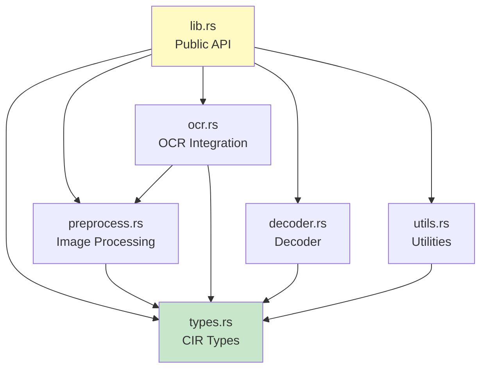
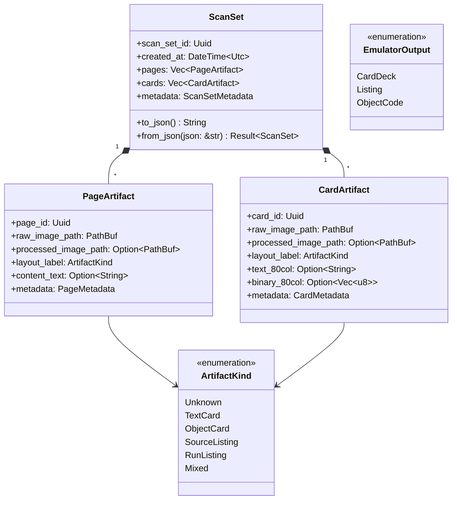
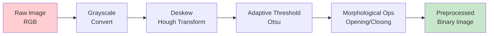

# Core Pipeline

The **core_pipeline** crate contains all core processing logic, data types, and algorithms. It has **no networking dependencies** - purely functional image processing, OCR integration, and type definitions.

## Table of Contents

- [Overview](#overview)
- [Module Structure](#module-structure)
- [Canonical Intermediate Representation (CIR)](#canonical-intermediate-representation-cir)
- [Image Preprocessing](#image-preprocessing)
- [OCR Integration](#ocr-integration)
- [IBM 1130 Object Deck Decoder](#ibm-1130-object-deck-decoder)
- [API Reference](#api-reference)

## Overview

**Crate Name:** `core_pipeline`
**Type:** Library
**Dependencies:** image, imageproc, leptess, serde, uuid, anyhow
**No Dependencies On:** reqwest, axum, tokio (no networking!)

### Responsibilities

1. Define CIR types (ScanSet, PageArtifact, CardArtifact)
2. Image preprocessing (deskew, threshold, denoise)
3. Tesseract OCR integration
4. IBM 1130 object deck parsing
5. Basic artifact classification heuristics

### Design Principles

- **Pure functions:** All processing functions are pure (no side effects)
- **No I/O:** Caller handles file I/O, core_pipeline works on in-memory data
- **Testable:** Every function has unit tests with synthetic data
- **No networking:** External API calls belong in llm_bridge

## Module Structure

```
core_pipeline/src/
├── lib.rs          # Public API exports
├── types.rs        # CIR types (ScanSet, Artifacts, Enums)
├── preprocess.rs   # Image preprocessing functions
├── ocr.rs          # Tesseract OCR integration
├── decoder.rs      # IBM 1130 object deck decoder
└── utils.rs        # Utility functions
```

### Module Dependency Graph



## Canonical Intermediate Representation (CIR)

The CIR is the central data structure flowing through the entire pipeline.

### Type Hierarchy



### ScanSet Serialization

```rust
// Serialize to JSON
let scan_set = ScanSet::new();
let json = scan_set.to_json()?;
std::fs::write("artifacts.json", json)?;

// Deserialize from JSON
let json = std::fs::read_to_string("artifacts.json")?;
let scan_set = ScanSet::from_json(&json)?;
```

### Metadata Fields

**PageMetadata:**
- `page_number: Option<u32>` - Page number from header/footer
- `header: Option<String>` - Header text
- `footer: Option<String>` - Footer text
- `original_filenames: Vec<String>` - All filenames for this image (duplicates)
- `notes: Vec<String>` - Human/LLM annotations
- `confidence: f32` - Classification confidence (0.0-1.0)

**CardMetadata:**
- `sequence_number: Option<String>` - Card sequence (columns 73-80)
- `deck_name: Option<String>` - Deck identifier
- `original_filenames: Vec<String>` - Filenames (deduplication)
- `notes: Vec<String>` - Annotations
- `confidence: f32` - Classification confidence

## Image Preprocessing

Classical computer vision techniques for improving OCR accuracy.

### Preprocessing Pipeline



### Grayscale Conversion

```rust
use image::{GrayImage, DynamicImage};

pub fn to_grayscale(img: &DynamicImage) -> GrayImage {
    img.to_luma8()
}
```

**Purpose:** Reduce RGB to single-channel intensity
**Algorithm:** Weighted average (0.299R + 0.587G + 0.114B)
**Use Case:** Required for all subsequent operations

### Deskewing

```rust
pub fn deskew(img: &GrayImage) -> Result<GrayImage> {
    // 1. Detect edges (Canny or Sobel)
    let edges = detect_edges(img)?;

    // 2. Hough transform to find lines
    let lines = hough_lines(&edges)?;

    // 3. Calculate dominant angle
    let angle = calculate_skew_angle(&lines)?;

    // 4. Rotate image to correct skew
    rotate_image(img, -angle)
}
```

**Purpose:** Correct rotated scans
**Algorithm:** Hough Line Transform
**Range:** Typically -15° to +15°
**Performance:** ~50-100ms per image

### Adaptive Thresholding

```rust
pub fn adaptive_threshold(img: &GrayImage) -> GrayImage {
    // Otsu's method for automatic threshold selection
    let threshold = otsu_threshold(img);
    binarize(img, threshold)
}
```

**Purpose:** Convert to binary (black/white) for OCR
**Algorithm:** Otsu's method (maximizes inter-class variance)
**Advantage:** Adapts to varying lighting conditions
**Output:** Binary image (0 or 255 per pixel)

### Morphological Operations

```rust
pub fn morphological_cleanup(img: &GrayImage) -> GrayImage {
    let kernel = create_structuring_element(3, 3);

    // Opening: erosion followed by dilation (removes noise)
    let opened = morphological_open(img, &kernel);

    // Closing: dilation followed by erosion (fills gaps)
    morphological_close(&opened, &kernel)
}
```

**Purpose:** Remove noise and fill gaps in text
**Operations:**
- **Opening:** Remove small white noise specks
- **Closing:** Fill small black holes in characters
**Kernel:** 3x3 or 5x5 structuring element

### Full Preprocessing Function

```rust
pub fn preprocess_for_ocr(img: &DynamicImage) -> Result<GrayImage> {
    // 1. Convert to grayscale
    let gray = to_grayscale(img);

    // 2. Deskew if needed
    let deskewed = deskew(&gray)?;

    // 3. Adaptive threshold
    let binary = adaptive_threshold(&deskewed);

    // 4. Morphological cleanup
    let cleaned = morphological_cleanup(&binary);

    Ok(cleaned)
}
```

## OCR Integration

Tesseract OCR integration with IBM 1130-specific configuration.

### Tesseract Setup

```rust
use leptess::{LepTess, Variable};

pub fn create_tesseract() -> Result<LepTess> {
    let mut tesseract = LepTess::new(None, "eng")?;

    // IBM 1130 character whitelist
    tesseract.set_variable(
        Variable::TesseditCharWhitelist,
        "0123456789ABCDEFGHIJKLMNOPQRSTUVWXYZ +-*/=(),.;:"
    )?;

    // Page segmentation mode: Single uniform block of text
    tesseract.set_variable(Variable::TesseditPagesegMode, "6")?;

    Ok(tesseract)
}
```

**Character Whitelist:**
- Uppercase letters A-Z (IBM 1130 is uppercase-only)
- Digits 0-9
- Common operators: + - * / =
- Delimiters: ( ) , . ; :
- Space

**Why No Lowercase?**
- IBM 1130 output is uppercase-only
- Reduces OCR confusion (O vs o, I vs l)

### OCR Extraction

```rust
pub fn extract_text(img: &GrayImage) -> Result<String> {
    let mut tesseract = create_tesseract()?;

    // Set image
    tesseract.set_image_from_mem(img.as_raw())?;

    // Extract text
    let text = tesseract.get_utf8_text()?;

    // Post-process
    let cleaned = post_process_ocr_text(&text);

    Ok(cleaned)
}
```

### OCR Post-Processing

```rust
fn post_process_ocr_text(raw: &str) -> String {
    raw.lines()
        .map(|line| {
            line
                // Remove trailing whitespace
                .trim_end()
                // Normalize multiple spaces to single space
                .split_whitespace()
                .collect::<Vec<_>>()
                .join(" ")
        })
        // Filter empty lines
        .filter(|line| !line.is_empty())
        .collect::<Vec<_>>()
        .join("\n")
}
```

**Post-Processing Steps:**
1. Trim trailing whitespace per line
2. Normalize multiple spaces to single space
3. Remove completely empty lines
4. Preserve line breaks (important for code)

### 80-Column Card Extraction

```rust
pub fn extract_80_column_text(img: &GrayImage) -> Result<Vec<String>> {
    // Detect column positions (punch card has 80 fixed columns)
    let column_positions = detect_column_boundaries(img)?;

    let mut cards = Vec::new();

    // Extract each row as one card
    for row_bounds in detect_row_boundaries(img)? {
        let mut card_text = String::with_capacity(80);

        for col in 0..80 {
            let char_img = extract_character_region(
                img,
                row_bounds,
                column_positions[col]
            )?;

            let ch = recognize_character(&char_img)?;
            card_text.push(ch);
        }

        cards.push(card_text);
    }

    Ok(cards)
}
```

**IBM 1130 Punch Card Format:**
- Exactly 80 columns
- Fixed-width characters
- Columns 73-80 often contain sequence numbers
- Columns 1-72 contain code/data

## IBM 1130 Object Deck Decoder

Parser for IBM 1130 object deck binary format.

### Object Deck Format

IBM 1130 object decks use a compressed binary format:

```
Column  Purpose
1-2     Card type code
3-5     Address field (compressed)
6-80    Binary data or control info
```

### Card Type Codes

| Code | Type | Description |
|------|------|-------------|
| `*W` | Write | Load data at address |
| `*L` | Label | Define symbol |
| `*T` | Transfer | Set starting address |
| `*C` | Checksum | Verify deck integrity |

### Decoder Implementation

```rust
pub struct ObjectDeck {
    pub cards: Vec<ObjectCard>,
    pub entry_point: Option<u16>,
    pub symbols: HashMap<String, u16>,
}

pub enum ObjectCard {
    Write { address: u16, data: Vec<u16> },
    Label { name: String, address: u16 },
    Transfer { address: u16 },
    Checksum { expected: u16 },
}

pub fn decode_object_deck(cards: &[String]) -> Result<ObjectDeck> {
    let mut deck = ObjectDeck::default();

    for card_text in cards {
        let card = parse_object_card(card_text)?;

        match card {
            ObjectCard::Write { address, data } => {
                // Store data at address
                deck.memory.insert(address, data);
            }
            ObjectCard::Label { name, address } => {
                // Record symbol
                deck.symbols.insert(name, address);
            }
            ObjectCard::Transfer { address } => {
                // Set entry point
                deck.entry_point = Some(address);
            }
            ObjectCard::Checksum { expected } => {
                // Validate checksum
                verify_checksum(&deck, expected)?;
            }
        }
    }

    Ok(deck)
}
```

### Checksum Validation

```rust
fn calculate_checksum(deck: &ObjectDeck) -> u16 {
    deck.cards
        .iter()
        .flat_map(|card| match card {
            ObjectCard::Write { data, .. } => data.clone(),
            _ => vec![],
        })
        .fold(0u16, |acc, word| acc.wrapping_add(word))
}

fn verify_checksum(deck: &ObjectDeck, expected: u16) -> Result<()> {
    let actual = calculate_checksum(deck);
    if actual == expected {
        Ok(())
    } else {
        Err(anyhow::anyhow!(
            "Checksum mismatch: expected {}, got {}",
            expected,
            actual
        ))
    }
}
```

## API Reference

### Public Functions

#### Image Preprocessing

```rust
// Convert to grayscale
pub fn to_grayscale(img: &DynamicImage) -> GrayImage;

// Deskew image
pub fn deskew(img: &GrayImage) -> Result<GrayImage>;

// Apply adaptive threshold
pub fn adaptive_threshold(img: &GrayImage) -> GrayImage;

// Full preprocessing pipeline
pub fn preprocess_for_ocr(img: &DynamicImage) -> Result<GrayImage>;
```

#### OCR

```rust
// Create configured Tesseract instance
pub fn create_tesseract() -> Result<LepTess>;

// Extract text from image
pub fn extract_text(img: &GrayImage) -> Result<String>;

// Extract 80-column cards
pub fn extract_80_column_text(img: &GrayImage) -> Result<Vec<String>>;
```

#### Decoder

```rust
// Decode IBM 1130 object deck
pub fn decode_object_deck(cards: &[String]) -> Result<ObjectDeck>;

// Parse single object card
pub fn parse_object_card(card_text: &str) -> Result<ObjectCard>;

// Disassemble binary to assembly
pub fn disassemble(data: &[u16], start_addr: u16) -> Vec<Instruction>;
```

#### CIR Types

```rust
// Create new ScanSet
pub fn ScanSet::new() -> Self;

// Serialize/deserialize
pub fn ScanSet::to_json(&self) -> Result<String>;
pub fn ScanSet::from_json(json: &str) -> Result<Self>;

// Add artifacts
pub fn ScanSet::add_page(&mut self, artifact: PageArtifact);
pub fn ScanSet::add_card(&mut self, artifact: CardArtifact);
```

### Usage Examples

#### Basic OCR Pipeline

```rust
use core_pipeline::*;
use image::open;

// Load image
let img = open("scan.jpg")?;

// Preprocess
let preprocessed = preprocess_for_ocr(&img)?;

// Extract text
let text = extract_text(&preprocessed)?;

println!("OCR Result:\n{}", text);
```

#### Create ScanSet with Deduplication

```rust
use core_pipeline::*;
use sha2::{Sha256, Digest};
use std::collections::HashMap;

let mut scan_set = ScanSet::new();
let mut hash_map: HashMap<String, Uuid> = HashMap::new();

for file_path in image_files {
    // Read image bytes
    let bytes = std::fs::read(&file_path)?;

    // Compute hash
    let mut hasher = Sha256::new();
    hasher.update(&bytes);
    let hash = format!("{:x}", hasher.finalize());

    if let Some(existing_id) = hash_map.get(&hash) {
        // Duplicate: append filename to existing artifact
        let artifact = scan_set.find_page_mut(*existing_id)?;
        artifact.metadata.original_filenames.push(file_path.clone());
    } else {
        // New: create artifact
        let artifact = PageArtifact {
            page_id: Uuid::new_v4(),
            raw_image_path: PathBuf::from(format!("images/{}.jpg", hash)),
            metadata: PageMetadata {
                original_filenames: vec![file_path.clone()],
                ..Default::default()
            },
            ..Default::default()
        };

        hash_map.insert(hash, artifact.page_id);
        scan_set.add_page(artifact);
    }
}

// Save ScanSet
let json = scan_set.to_json()?;
std::fs::write("artifacts.json", json)?;
```

## Testing

### Unit Tests

```rust
#[cfg(test)]
mod tests {
    use super::*;

    #[test]
    fn test_grayscale_conversion() {
        let img = create_test_rgb_image();
        let gray = to_grayscale(&img);
        assert_eq!(gray.dimensions(), img.dimensions());
    }

    #[test]
    fn test_adaptive_threshold() {
        let gray = create_test_grayscale_image();
        let binary = adaptive_threshold(&gray);
        // All pixels should be 0 or 255
        for pixel in binary.pixels() {
            assert!(pixel[0] == 0 || pixel[0] == 255);
        }
    }

    #[test]
    fn test_ocr_extraction() {
        let img = create_synthetic_text_image("HELLO WORLD");
        let text = extract_text(&img).unwrap();
        assert_eq!(text.trim(), "HELLO WORLD");
    }
}
```

### Integration Tests

Located in `core_pipeline/tests/`:

```rust
// tests/ocr_pipeline.rs
use core_pipeline::*;

#[test]
fn test_full_ocr_pipeline() {
    let img = image::open("test-data/sample-listing.jpg").unwrap();
    let preprocessed = preprocess_for_ocr(&img).unwrap();
    let text = extract_text(&preprocessed).unwrap();

    assert!(text.contains("IBM 1130"));
    assert!(!text.is_empty());
}
```

## Performance Characteristics

| Operation | Typical Time | Depends On |
|-----------|-------------|------------|
| Grayscale conversion | <5ms | Image size |
| Deskew (Hough) | 50-100ms | Image size, skew angle |
| Adaptive threshold | 10-20ms | Image size |
| Morphological ops | 5-10ms | Kernel size |
| Tesseract OCR | 200-500ms | Image size, text density |
| Object deck decode | <1ms | Deck size |

**Optimization Opportunities:**
- Use rayon for parallel batch processing
- Cache preprocessed images
- Skip deskew if angle < 1°

## Related Pages

- [Architecture](Architecture) - Overall system design
- [Data Flow](Data-Flow) - Pipeline sequence diagrams
- [LLM Bridge](LLM-Bridge) - External API integration
- [CLI](CLI) - Command-line usage of core_pipeline

---

**Last Updated:** 2025-11-16
**Component Version:** 0.1.0
