# Data Flow & Sequence Diagrams

This page details the data flows through scan3data's three-phase pipeline, including sequence diagrams for key operations.

## Table of Contents

- [Three-Phase Pipeline Overview](#three-phase-pipeline-overview)
- [Phase 1: Scan (Ingest)](#phase-1-scan-ingest)
- [Phase 2: Classify & Correct (Analyze)](#phase-2-classify--correct-analyze)
- [Phase 3: Convert (Export)](#phase-3-convert-export)
- [Web UI Workflows](#web-ui-workflows)
- [Duplicate Detection Flow](#duplicate-detection-flow)
- [Error Handling Flow](#error-handling-flow)

## Three-Phase Pipeline Overview

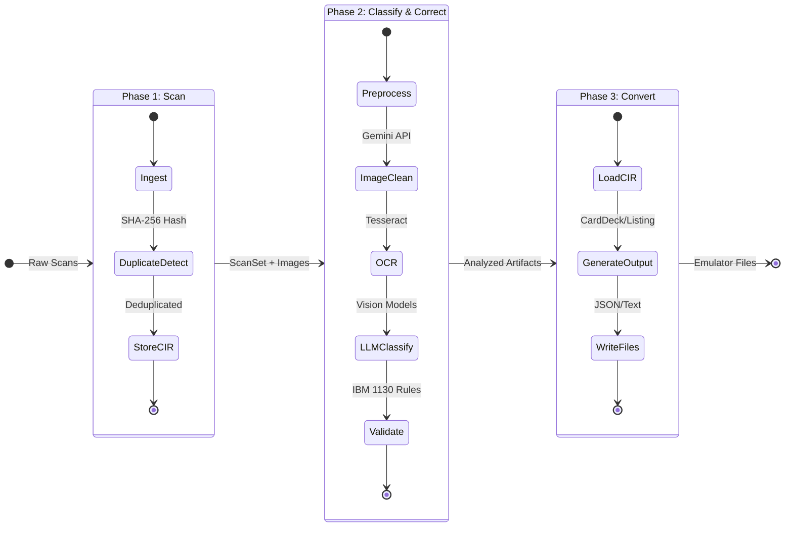

## Phase 1: Scan (Ingest)

The ingest phase loads raw scans, detects duplicates, and creates the initial ScanSet.

### CLI Ingest Sequence

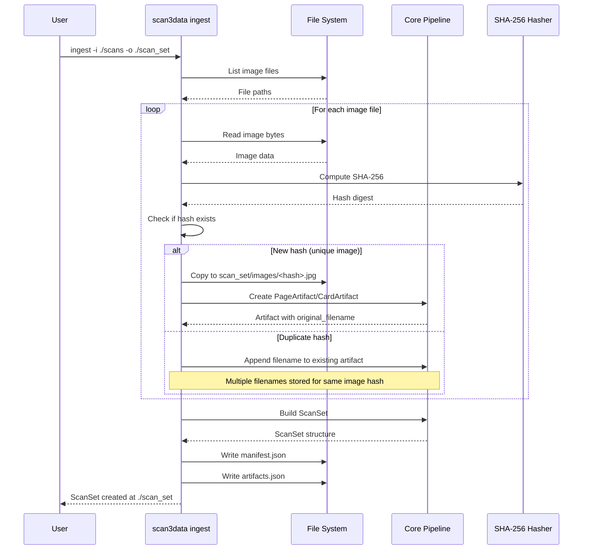

### Ingest Data Transformations

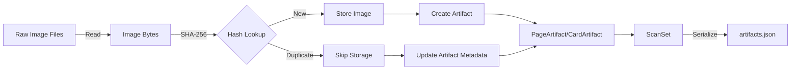

### Ingest Output Structure

```
scan_set_001/
├── manifest.json          # ScanSetId, created_at, etc.
├── images/
│   ├── a1b2c3d4...jpg    # SHA-256 hash as filename
│   ├── e5f6g7h8...jpg    # Each file is unique
│   └── ...
└── artifacts.json         # All PageArtifact and CardArtifact records
```

## Phase 2: Classify & Correct (Analyze)

The analyze phase runs OCR, classifies artifacts, and optionally uses LLMs for enhancement.

### CLI Analyze Sequence (Baseline - No LLM)

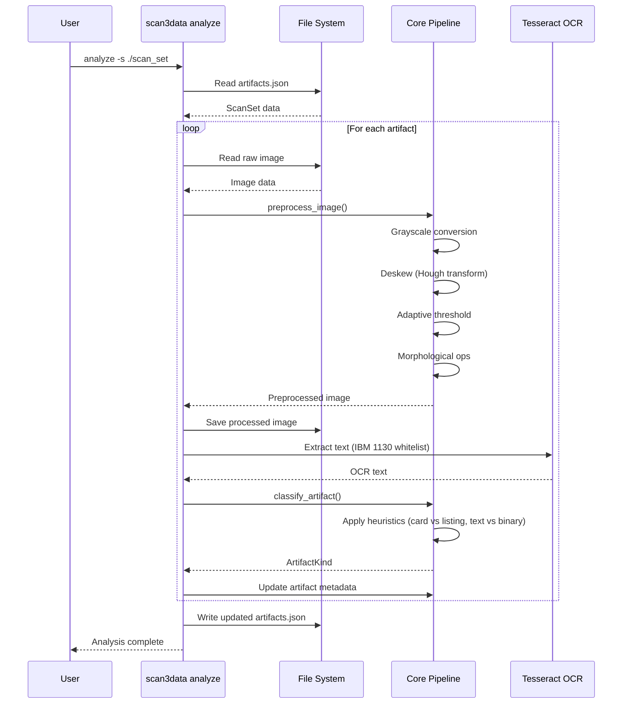

### CLI Analyze Sequence (LLM-Enhanced)

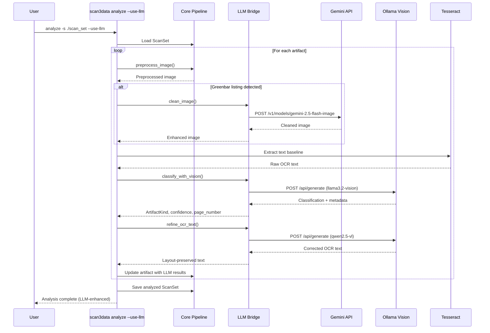

### Analyze Data Transformations

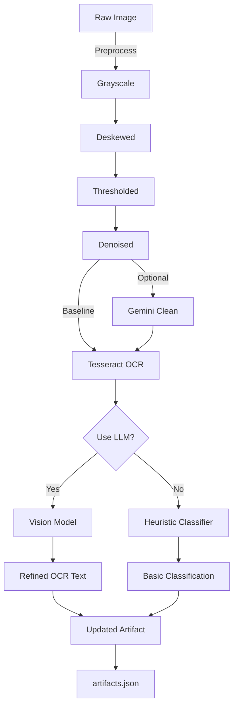

## Phase 3: Convert (Export)

The export phase generates emulator-ready output from analyzed artifacts.

### CLI Export Sequence

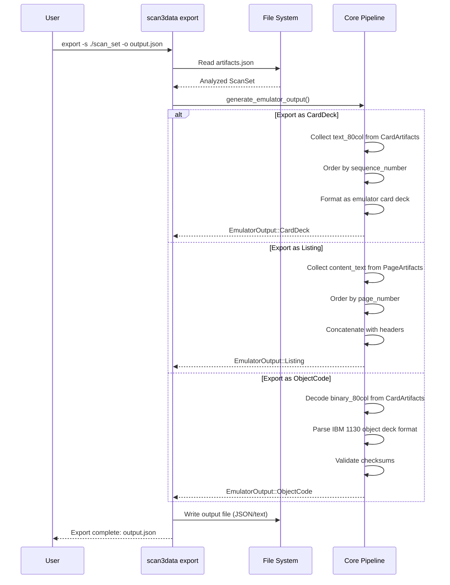

### Export Format Examples

#### CardDeck Format (JSON)

```json
{
  "format": "card_deck",
  "deck_name": "forth-1970",
  "cards": [
    {
      "sequence": "00010",
      "text": "       LATEST @ CFA NFA DUP C@ 31 AND"
    },
    {
      "sequence": "00020",
      "text": "       OVER 2+ + 1 MIN NEGATE AND"
    }
  ]
}
```

#### Listing Format (Text)

```
IBM 1130 SOURCE LISTING
Page 1 of 15
Date: 1970-06-15

00010        LATEST @ CFA NFA DUP C@ 31 AND
00020        OVER 2+ + 1 MIN NEGATE AND
00030        DUP >R - CMOVE R> LATEST !
```

## Web UI Workflows

The web UI implements a 4-stage pipeline with visual feedback and user interaction.

### Web UI Upload & Clean Sequence

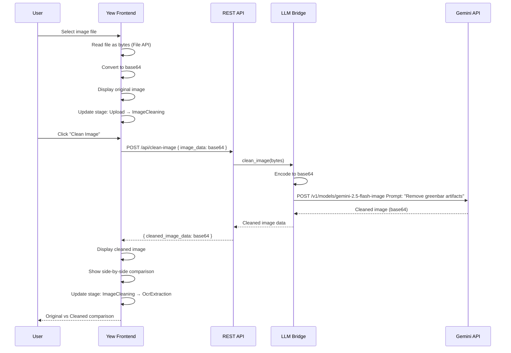

### Web UI OCR & Validation Sequence (Planned)

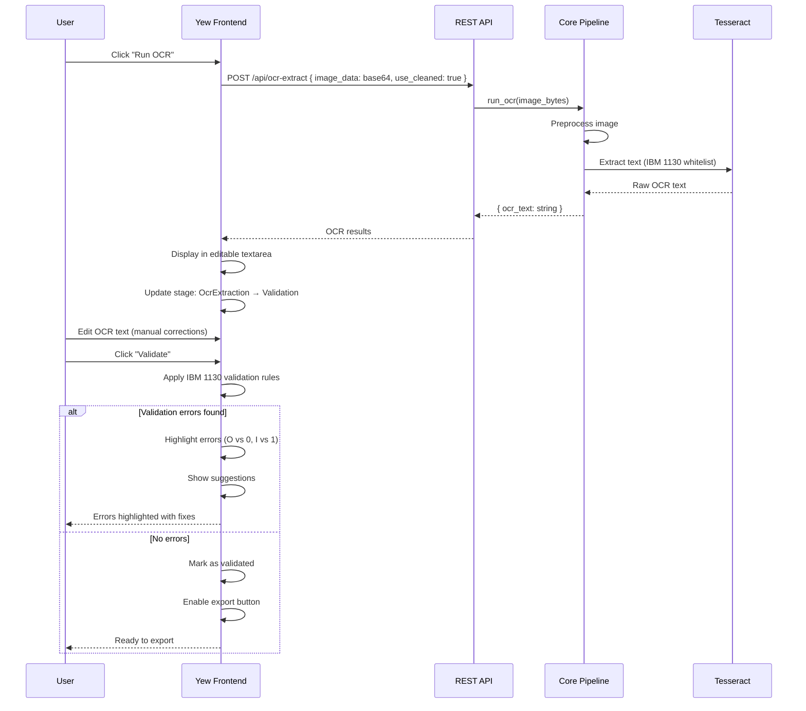

### Web UI State Machine

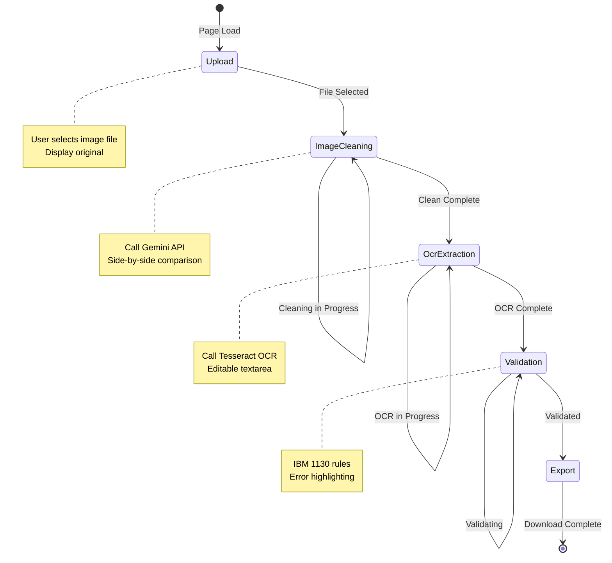

## Duplicate Detection Flow

Detailed flow for SHA-256-based duplicate detection during ingest.

### Duplicate Detection Algorithm

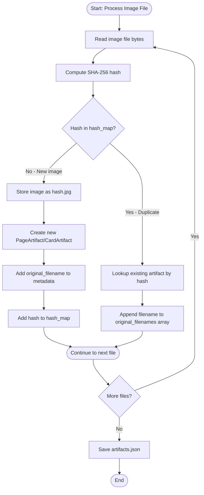

### Duplicate Detection Example

**Input Files:**
```
scans/
├── forth-p1.jpg          # 512 KB
├── moore-1130-page1.jpg  # 510 KB (same image, different filename)
└── forth-p2.jpg          # 498 KB (different image)
```

**After Ingest:**
```
scan_set/
├── images/
│   ├── a1b2c3d4e5f6...jpg  # forth-p1.jpg and moore-1130-page1.jpg (same hash)
│   └── 7g8h9i0j1k2l...jpg  # forth-p2.jpg
└── artifacts.json
```

**artifacts.json:**
```json
{
  "pages": [
    {
      "page_id": "uuid-001",
      "raw_image_path": "images/a1b2c3d4e5f6...jpg",
      "metadata": {
        "original_filenames": [
          "forth-p1.jpg",
          "moore-1130-page1.jpg"
        ],
        "notes": ["Duplicate detected - same hash"]
      }
    },
    {
      "page_id": "uuid-002",
      "raw_image_path": "images/7g8h9i0j1k2l...jpg",
      "metadata": {
        "original_filenames": ["forth-p2.jpg"]
      }
    }
  ]
}
```

**Why This Matters:**
- Saves disk space (one copy instead of two)
- Filenames provide context hints for LLMs
- Example: "forth" + "moore" + "1130" → High confidence this is Chuck Moore's Forth

## Error Handling Flow

### Error Propagation Through Pipeline

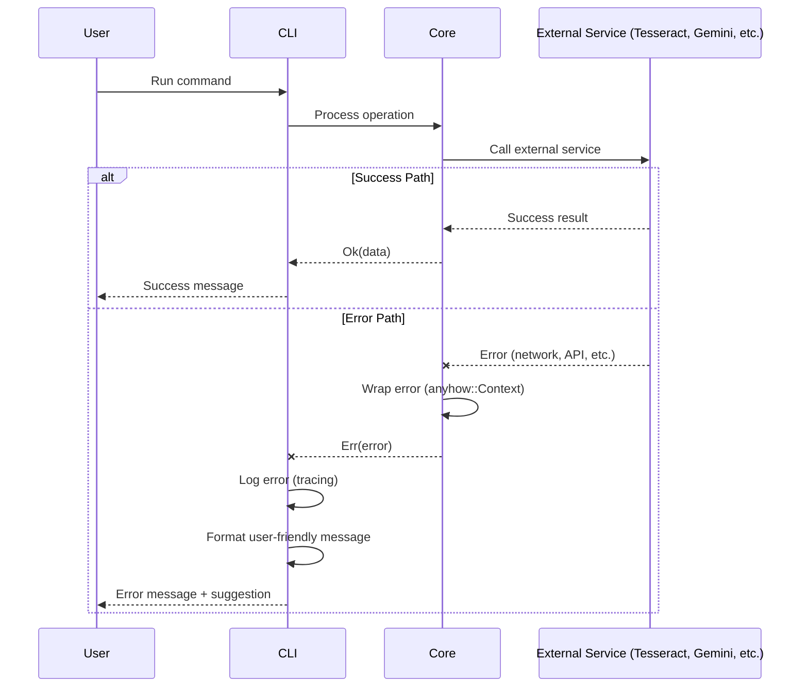

### Error Handling Strategy

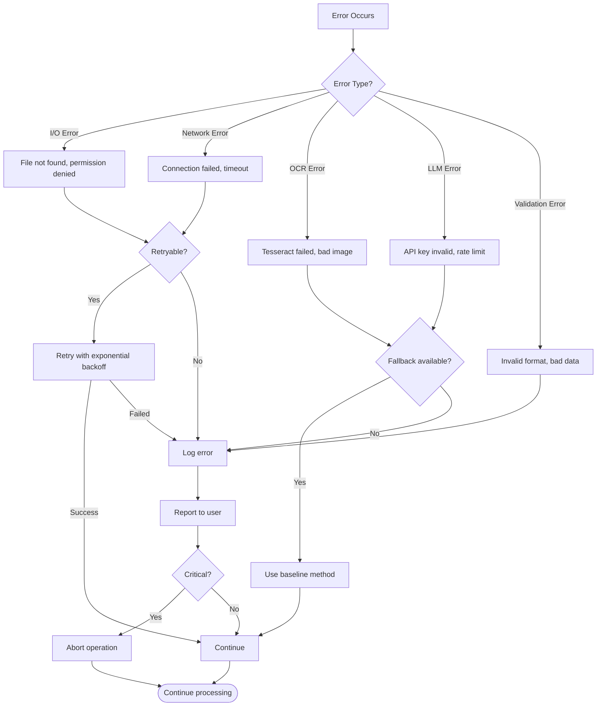

### Example Error Flows

#### OCR Failure with Fallback

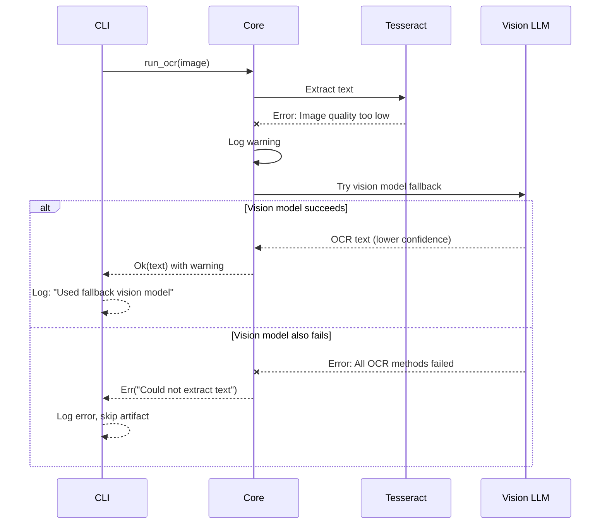

#### Gemini API Rate Limit

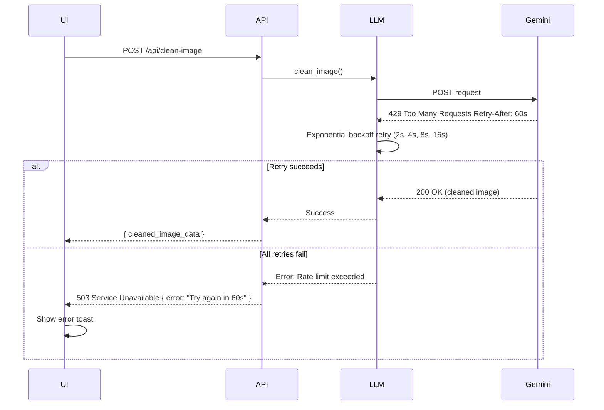

## Related Pages

- [Architecture](Architecture) - System architecture and component diagrams
- [Core Pipeline](Core-Pipeline) - Detailed image processing flows
- [LLM Bridge](LLM-Bridge) - API integration details
- [REST API](REST-API) - API endpoint specifications
- [Web UI](Web-UI) - Frontend component interactions
- [CLI](CLI) - Command-line usage and workflows

---

**Last Updated:** 2025-11-16
**Flow Diagrams Version:** 1.0
