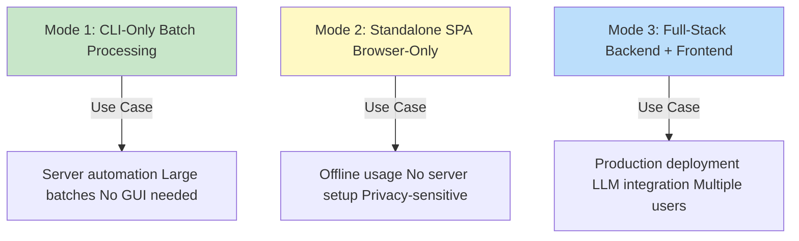
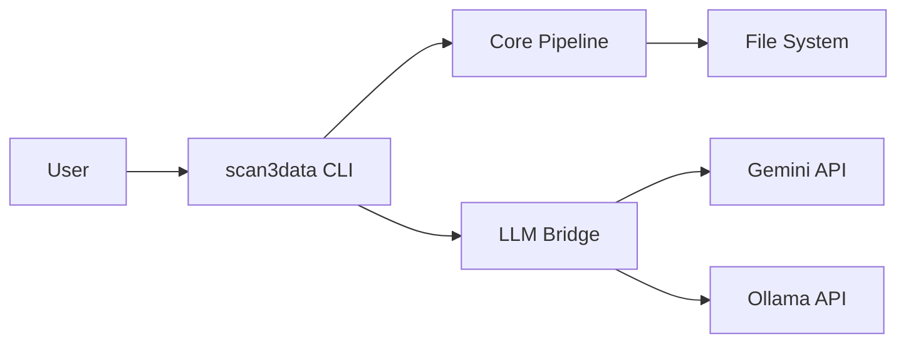
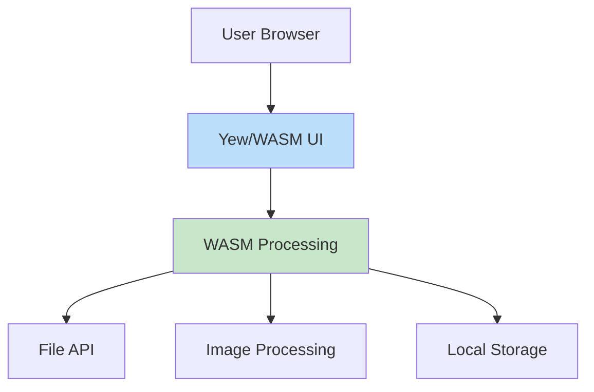
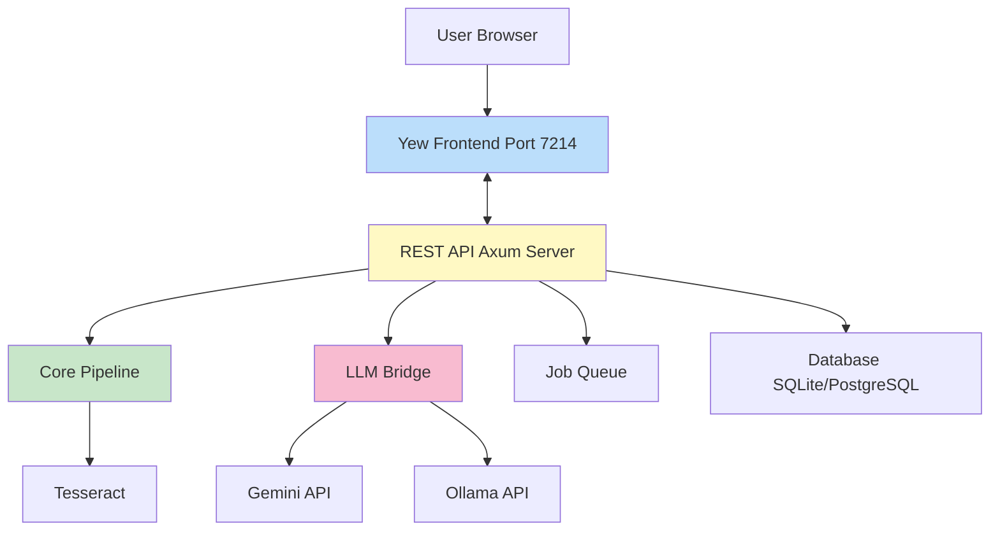

# Deployment Modes

scan3data supports three deployment modes to suit different use cases: CLI-only batch processing, standalone SPA, and full-stack API mode.

## Overview



## Mode 1: CLI-Only (Batch Processing)

### Architecture



### Use Cases

- **Server automation:** Cron jobs, systemd timers
- **Large batch processing:** Thousands of scans
- **CI/CD pipelines:** Automated testing and validation
- **No GUI needed:** Headless servers

### Setup

```bash
# Build CLI
./scripts/build-cli.sh

# Install to system
sudo cp target/release/scan3data /usr/local/bin/

# Verify
scan3data --version
```

### Usage

Three-phase pipeline via CLI commands:

```bash
# Phase 1: Ingest (Scan)
scan3data ingest -i ./raw_scans -o ./scan_set_001

# Phase 2: Analyze (Classify & Correct)
scan3data analyze -s ./scan_set_001 --use-llm

# Phase 3: Export (Convert)
scan3data export -s ./scan_set_001 -o forth-deck.json
```

### Automation Example

**Cron job (process new scans daily):**

```bash
# /etc/cron.daily/scan3data-process.sh
#!/bin/bash
set -euo pipefail

SCAN_DIR="/mnt/scanner/output"
ARCHIVE_DIR="/mnt/archive/scan_sets"
DATE=$(date +%Y%m%d)

# Create scan set
scan3data ingest -i "$SCAN_DIR" -o "$ARCHIVE_DIR/scan_set_$DATE"

# Analyze with LLMs
GEMINI_API_KEY="$GEMINI_KEY" scan3data analyze \
    -s "$ARCHIVE_DIR/scan_set_$DATE" \
    --use-llm

# Export results
scan3data export \
    -s "$ARCHIVE_DIR/scan_set_$DATE" \
    -o "$ARCHIVE_DIR/scan_set_$DATE/output.json"

# Clean up input directory
mv "$SCAN_DIR"/* "$ARCHIVE_DIR/processed/"
```

### Systemd Service

```ini
# /etc/systemd/system/scan3data-watch.service
[Unit]
Description=scan3data scan directory watcher
After=network.target

[Service]
Type=simple
User=scanner
Environment="GEMINI_API_KEY=your-key-here"
ExecStart=/usr/local/bin/scan3data-watch.sh
Restart=always

[Install]
WantedBy=multi-user.target
```

### Advantages

- ✅ No web server required
- ✅ Minimal resource usage
- ✅ Easy to automate
- ✅ Perfect for batch processing
- ✅ Can run headless

### Limitations

- ❌ No interactive UI
- ❌ No real-time progress feedback
- ❌ Requires command-line knowledge

## Mode 2: Standalone SPA

### Architecture



### Use Cases

- **Offline usage:** No internet required (after initial load)
- **No server setup:** Just serve static files
- **Privacy-sensitive:** All processing in browser
- **Demos and prototyping:** Quick setup

### Setup

```bash
# Build WASM frontend
./scripts/build-wasm.sh

# Serve with any static file server
cd dist
python3 -m http.server 8080

# Or use serve script
./scripts/serve-spa.sh 8080
```

### Architecture Details

**Processing in Browser:**
- Image upload: File API
- Preprocessing: Photon (Rust/WASM image library)
- OCR: Limited (would need Tesseract.js or backend call)
- Export: Download API

**Current Status:** 🚧 Planned (Phase 3)

### Deployment

**Static File Hosts:**

```bash
# Netlify
netlify deploy --dir=dist --prod

# Vercel
vercel --prod

# GitHub Pages
git subtree push --prefix dist origin gh-pages

# AWS S3 + CloudFront
aws s3 sync dist/ s3://scan3data-app/
aws cloudfront create-invalidation --distribution-id XXX --paths "/*"
```

### Advantages

- ✅ No backend server needed
- ✅ Works offline (after initial load)
- ✅ Privacy-friendly (local processing)
- ✅ Easy deployment (static files)
- ✅ Low hosting costs

### Limitations

- ❌ Limited OCR capabilities (no native Tesseract)
- ❌ No LLM integration (or requires API keys in browser)
- ❌ Performance limited by browser
- ❌ Large WASM bundle size

## Mode 3: Full-Stack (Backend + Frontend)

### Architecture



### Use Cases

- **Production deployment:** Real-world applications
- **LLM integration:** Gemini and Ollama support
- **Multiple users:** Concurrent processing
- **Heavy workloads:** Server-side processing
- **Progress updates:** WebSocket real-time feedback

### Setup

**Development:**

```bash
# Build all components
./scripts/build-all.sh

# Run server (serves both API and frontend)
GEMINI_API_KEY="your-key" ./target/release/scan3data-server

# Access at http://localhost:7214
```

**Production:**

```bash
# Build optimized binaries
cargo build --release

# Build WASM frontend
./scripts/build-wasm.sh

# Copy frontend to server static directory
cp -r dist /opt/scan3data/static/

# Run server
GEMINI_API_KEY="$KEY" /opt/scan3data/bin/scan3data-server
```

### Docker Deployment

**Dockerfile:**

```dockerfile
FROM rust:1.75 as builder

WORKDIR /app
COPY . .

# Build Rust binaries
RUN cargo build -p scan3data-server --release

# Build WASM frontend
RUN rustup target add wasm32-unknown-unknown && \
    cargo install trunk && \
    cd crates/yew_frontend && \
    trunk build --release

FROM debian:bookworm-slim

# Install runtime dependencies
RUN apt-get update && \
    apt-get install -y tesseract-ocr ca-certificates && \
    rm -rf /var/lib/apt/lists/*

# Copy binaries and static files
COPY --from=builder /app/target/release/scan3data-server /usr/local/bin/
COPY --from=builder /app/dist /app/static

# Environment
ENV RUST_LOG=info
EXPOSE 7214

CMD ["scan3data-server"]
```

**docker-compose.yml:**

```yaml
version: '3.8'

services:
  scan3data:
    build: .
    ports:
      - "7214:7214"
    environment:
      - GEMINI_API_KEY=${GEMINI_API_KEY}
      - OLLAMA_BASE_URL=http://ollama:11434
    volumes:
      - scan_sets:/data/scan_sets
    depends_on:
      - ollama

  ollama:
    image: ollama/ollama:latest
    ports:
      - "11434:11434"
    volumes:
      - ollama_data:/root/.ollama

volumes:
  scan_sets:
  ollama_data:
```

**Run:**

```bash
# Start all services
docker-compose up -d

# View logs
docker-compose logs -f scan3data

# Access UI
open http://localhost:7214
```

### Systemd Service

```ini
# /etc/systemd/system/scan3data-server.service
[Unit]
Description=scan3data REST API Server
After=network.target

[Service]
Type=simple
User=scan3data
WorkingDirectory=/opt/scan3data
Environment="GEMINI_API_KEY=your-key-here"
Environment="RUST_LOG=info"
ExecStart=/opt/scan3data/bin/scan3data-server
Restart=always
RestartSec=10

[Install]
WantedBy=multi-user.target
```

**Enable and start:**

```bash
sudo systemctl enable scan3data-server
sudo systemctl start scan3data-server
sudo systemctl status scan3data-server
```

### Nginx Reverse Proxy

```nginx
server {
    listen 80;
    server_name scan3data.example.com;

    # Redirect to HTTPS
    return 301 https://$server_name$request_uri;
}

server {
    listen 443 ssl http2;
    server_name scan3data.example.com;

    ssl_certificate /etc/letsencrypt/live/scan3data.example.com/fullchain.pem;
    ssl_certificate_key /etc/letsencrypt/live/scan3data.example.com/privkey.pem;

    # Proxy to scan3data server
    location / {
        proxy_pass http://127.0.0.1:7214;
        proxy_set_header Host $host;
        proxy_set_header X-Real-IP $remote_addr;
        proxy_set_header X-Forwarded-For $proxy_add_x_forwarded_for;
        proxy_set_header X-Forwarded-Proto $scheme;
    }

    # WebSocket support (for future job progress)
    location /ws {
        proxy_pass http://127.0.0.1:7214;
        proxy_http_version 1.1;
        proxy_set_header Upgrade $http_upgrade;
        proxy_set_header Connection "upgrade";
    }
}
```

### Kubernetes Deployment

**deployment.yaml:**

```yaml
apiVersion: apps/v1
kind: Deployment
metadata:
  name: scan3data
spec:
  replicas: 3
  selector:
    matchLabels:
      app: scan3data
  template:
    metadata:
      labels:
        app: scan3data
    spec:
      containers:
      - name: scan3data-server
        image: scan3data:latest
        ports:
        - containerPort: 7214
        env:
        - name: GEMINI_API_KEY
          valueFrom:
            secretKeyRef:
              name: scan3data-secrets
              key: gemini-api-key
        volumeMounts:
        - name: scan-sets
          mountPath: /data/scan_sets
      volumes:
      - name: scan-sets
        persistentVolumeClaim:
          claimName: scan-sets-pvc
---
apiVersion: v1
kind: Service
metadata:
  name: scan3data
spec:
  selector:
    app: scan3data
  ports:
  - port: 80
    targetPort: 7214
  type: LoadBalancer
```

### Advantages

- ✅ Full feature set (Gemini, Ollama, Tesseract)
- ✅ Better performance (server-side processing)
- ✅ Multi-user support
- ✅ Real-time progress updates (planned)
- ✅ Job queue for long operations (planned)
- ✅ Scalable architecture

### Limitations

- ❌ Requires server infrastructure
- ❌ More complex deployment
- ❌ Higher hosting costs
- ❌ Requires internet connection

## Comparison Matrix

| Feature | CLI-Only | Standalone SPA | Full-Stack |
|---------|----------|----------------|------------|
| **GUI** | ❌ | ✅ | ✅ |
| **Server Required** | ❌ | ❌ | ✅ |
| **Offline** | ✅ | ✅ (after load) | ❌ |
| **LLM Integration** | ✅ | ❌ | ✅ |
| **Full Tesseract OCR** | ✅ | ❌ | ✅ |
| **Batch Processing** | ✅ | ❌ | ✅ |
| **Multi-User** | ❌ | ✅ (separate sessions) | ✅ |
| **Progress Tracking** | ❌ | ✅ | ✅ |
| **Automation** | ✅ | ❌ | ✅ (via API) |
| **Resource Usage** | Low | Low | Medium-High |
| **Setup Complexity** | Low | Low | High |
| **Hosting Cost** | Free | Very Low | Medium |

## Choosing a Mode

**Use CLI-Only when:**
- Running on servers/headless systems
- Processing large batches
- Integrating with other tools
- No GUI needed

**Use Standalone SPA when:**
- Offline processing required
- No server infrastructure available
- Privacy is critical
- Quick demo/prototype

**Use Full-Stack when:**
- Production deployment
- LLM features needed (Gemini, Ollama)
- Multiple users
- Best user experience required

## Hybrid Approach

You can combine modes:

```bash
# Process batch with CLI
scan3data ingest -i ./scans -o ./scan_set
scan3data analyze -s ./scan_set --use-llm

# View results in web UI
scan3data serve -p 8080 --mode api
# Open http://localhost:8080 and browse scan_set
```

## Related Pages

- [CLI](CLI) - CLI-only mode documentation
- [Web UI](Web-UI) - SPA and full-stack frontend
- [REST API](REST-API) - Full-stack backend API
- [Building](Building) - Building for each mode

---

**Last Updated:** 2025-11-16
