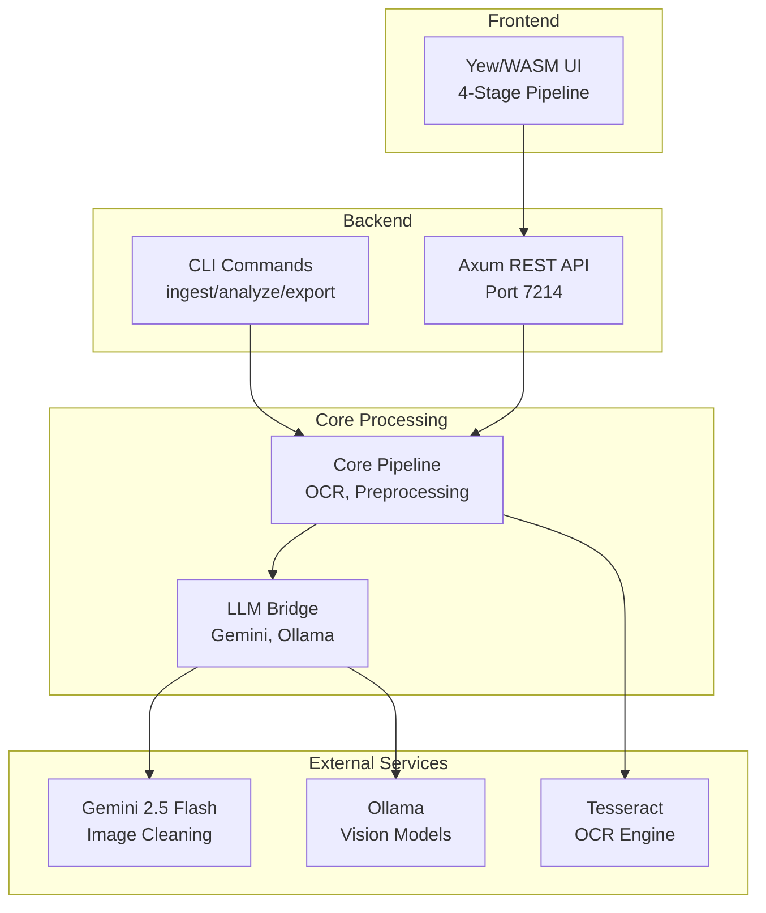

# scan3data Wiki

Welcome to the **scan3data** wiki! This documentation covers the architecture, components, and workflows of the three-phase IBM 1130 scan processing pipeline.

## Quick Navigation

### Architecture & Design
- **[Architecture Overview](Architecture)** - System architecture with block diagrams
- **[Data Flow](Data-Flow)** - Pipeline data flows and sequence diagrams
- **[Deployment Modes](Deployment-Modes)** - CLI, SPA, and Full-Stack configurations

### Components
- **[Core Pipeline](Core-Pipeline)** - Image processing, OCR, and CIR types
- **[LLM Bridge](LLM-Bridge)** - Gemini and Ollama API integration
- **[CLI](CLI)** - Command-line interface (scan3data binary)
- **[REST API](REST-API)** - Backend server (scan3data-server)
- **[Web UI](Web-UI)** - Yew/WASM frontend with 4-stage pipeline

### Developer Resources
- **[Building](Building)** - Build instructions and scripts
- **[Testing](Testing)** - Test strategy and running tests
- **[Contributing](Contributing)** - Development workflow and quality standards

## What is scan3data?

**scan3data** processes scanned images of IBM 1130 punch cards and computer listings into structured data for emulator consumption.

### Why "scan3data"?

The **3** represents our **three-phase processing pipeline**:

1. **Scan** - Ingest and digitize (image acquisition, duplicate detection, preprocessing)
2. **Classify & Correct** - Analyze and refine (OCR, LLM classification, ordering, gap detection)
3. **Convert** - Transform to structured output (emulator formats, reconstruction, export)

This isn't just a simple scanner - it's a complete three-stage transformation pipeline from messy historical scans to pristine emulator-ready data.

## Key Features

### Phase 1 - Baseline Processing (Completed)
- ✅ SHA-256 duplicate detection
- ✅ Classical image preprocessing (deskew, threshold, denoise)
- ✅ Tesseract OCR with IBM 1130 character whitelist
- ✅ 80-column punch card text extraction
- ✅ IBM 1130 object deck parsing
- ✅ CLI batch processing (ingest, analyze, export)

### Phase 2 - LLM Integration (In Progress)
- ✅ Gemini 2.5 Flash Image API for greenbar removal
- ✅ 4-stage web UI (Upload -> Clean -> OCR -> Validate)
- ✅ Image upload and cleaning pipeline
- 🚧 Ollama vision models for OCR correction
- 🚧 Layout-preserving OCR validation
- 🚧 IBM 1130-specific validation rules

### Phase 3 - Advanced Features (Planned)
- 📋 IBM 1130 disassembler
- 📋 Forth-specific syntax analysis
- 📋 Custom character recognition models
- 📋 Reverse engineering from object decks
- 📋 Document super-resolution
- 📋 Multi-user collaborative editing

## Quick Start

### Installation

```bash
# Clone the repository
git clone https://github.com/softwarewrighter/scan3data
cd scan3data

# Install Rust and dependencies
curl --proto '=https' --tlsv1.2 -sSf https://sh.rustup.rs | sh
rustup target add wasm32-unknown-unknown
cargo install trunk

# Build all components
./scripts/build-all.sh
```

### Basic Usage

```bash
# CLI: Process scans through the three-phase pipeline
scan3data ingest -i ./scans -o ./scan_set
scan3data analyze -s ./scan_set
scan3data export -s ./scan_set -o output.json

# Web UI: Start the server (port 7214)
./target/release/scan3data-server
# Open http://localhost:7214 in browser
```

See **[CLI](CLI)** for detailed command documentation.

## Architecture At-a-Glance



See **[Architecture Overview](Architecture)** for detailed diagrams.

## Project Structure

scan3data is organized as a Cargo workspace with 5 crates:

```
scan3data/
├── crates/
│   ├── core_pipeline/    # Core processing logic (no networking)
│   ├── llm_bridge/       # Gemini and Ollama API integration
│   ├── cli/              # Command-line interface (scan3data)
│   ├── server/           # REST API backend (scan3data-server)
│   └── yew_frontend/     # Browser UI (Yew/WASM)
├── scripts/              # Build and serve scripts
├── docs/                 # Documentation
├── wiki/                 # GitHub Wiki pages (this content)
└── test-data/            # Test scans (gitignored)
```

## Rust-First Philosophy

**This project is Rust-focused.** All business logic, data processing, and presentation code must be written in Rust.

- **Frontend**: Yew (Rust compiled to WebAssembly)
- **Backend**: Axum (pure Rust HTTP server)
- **Image Processing**: Rust crates (image, imageproc)
- **OCR**: Rust bindings (leptess for Tesseract)
- **CLI**: Rust (clap)

The only acceptable non-Rust code:
- Minimal HTML/CSS for web UI structure
- Calling external binaries (Tesseract, Ollama) via `Command::new()`

**No JavaScript. No TypeScript. No Python.**

## Community & Contributing

- **Repository**: https://github.com/softwarewrighter/scan3data
- **License**: MIT
- **Contributing**: See [Contributing](Contributing) for development workflow

### Quality Standards
- Zero clippy warnings (`-D warnings`)
- All tests must pass
- Test-Driven Development (Red/Green/Refactor)
- Files under 500 lines, functions under 50 lines
- Max 3 TODOs per file

### Getting Help

- Read the [Architecture Overview](Architecture) to understand the system
- Check [Building](Building) for build issues
- Review [Testing](Testing) for test failures
- See [Data Flow](Data-Flow) for pipeline behavior

## External Resources

- **IBM 1130 Documentation**: Various online sources for format specs
- **Tesseract OCR**: https://github.com/tesseract-ocr/tesseract
- **Yew Framework**: https://yew.rs
- **Axum Web Framework**: https://docs.rs/axum
- **Gemini API**: https://ai.google.dev/

---

**Wiki Version**: 1.0
**Last Updated**: 2025-11-16
**Project Version**: 0.1.0
