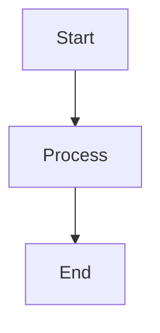

# scan3data Wiki Pages

This directory contains the source content for the scan3data GitHub Wiki.

## Contents

**Overview:**
- `Home.md` - Wiki home page with navigation

**Architecture:**
- `Architecture.md` - System architecture with block diagrams
- `Data-Flow.md` - Pipeline flows and sequence diagrams
- `Deployment-Modes.md` - CLI, SPA, and full-stack deployment

**Components:**
- `Core-Pipeline.md` - Core processing, OCR, IBM 1130 decoder
- `LLM-Bridge.md` - Gemini/Ollama API integration
- `CLI.md` - Command-line interface documentation
- `REST-API.md` - Axum server API endpoints
- `Web-UI.md` - Yew/WASM frontend

**Developer Resources:**
- `Building.md` - Build instructions
- `Testing.md` - Test strategy and TDD workflow
- `Contributing.md` - Development guidelines and quality standards

## Uploading to GitHub Wiki

### Method 1: Manual Upload (GitHub UI)

1. Go to your repository's Wiki tab on GitHub
2. Click "Create the first page" or "New Page"
3. Copy content from each `.md` file in this directory
4. Paste into GitHub Wiki editor
5. Use the filename (without `.md`) as the page title
6. Save each page

### Method 2: Git Clone (Command Line)

```bash
# Clone the wiki repository
git clone https://github.com/softwarewrighter/scan3data.wiki.git

# Copy wiki pages
cp wiki/*.md scan3data.wiki/

# Commit and push
cd scan3data.wiki
git add *.md
git commit -m "docs: Add comprehensive wiki pages with UML diagrams"
git push origin master
```

### Method 3: Script (Automated)

```bash
# Create upload script
cat > upload-wiki.sh << 'EOF'
#!/usr/bin/env bash
set -euo pipefail

WIKI_REPO="https://github.com/softwarewrighter/scan3data.wiki.git"
TEMP_DIR=$(mktemp -d)

echo "Cloning wiki repository..."
git clone "$WIKI_REPO" "$TEMP_DIR"

echo "Copying wiki pages..."
cp wiki/*.md "$TEMP_DIR/"

echo "Committing changes..."
cd "$TEMP_DIR"
git add *.md
git commit -m "docs: Update wiki pages from source"
git push origin master

echo "Cleaning up..."
rm -rf "$TEMP_DIR"

echo "Wiki pages uploaded successfully!"
EOF

chmod +x upload-wiki.sh
./upload-wiki.sh
```

## Diagram Rendering

All diagrams use **Mermaid** syntax, which GitHub Wiki supports natively:

````markdown

````

Diagrams will render automatically on GitHub Wiki pages.

## Updating Wiki Pages

1. Edit the `.md` files in this `wiki/` directory
2. Commit changes to the main repository
3. Re-upload to GitHub Wiki using one of the methods above

This keeps the wiki source under version control.

## Local Preview

To preview wiki pages locally with Mermaid rendering:

```bash
# Install markdown preview tool
npm install -g markdown-preview

# Preview a page
markdown-preview wiki/Home.md
```

Or use VSCode with the "Markdown Preview Mermaid Support" extension.

## Wiki Structure

```
GitHub Wiki
├── Home (Home.md)
├── Architecture (Architecture.md)
├── Data Flow (Data-Flow.md)
├── Deployment Modes (Deployment-Modes.md)
├── Core Pipeline (Core-Pipeline.md)
├── LLM Bridge (LLM-Bridge.md)
├── CLI (CLI.md)
├── REST API (REST-API.md)
├── Web UI (Web-UI.md)
├── Building (Building.md)
├── Testing (Testing.md)
└── Contributing (Contributing.md)
```

## Diagram Types Included

- **System Architecture:** Component block diagrams, dependency graphs
- **Data Flow:** Sequence diagrams, state machines, flowcharts
- **CIR Types:** Class diagrams showing type hierarchies
- **Deployment:** Deployment diagrams for each mode
- **Workflows:** TDD cycle, pre-commit process, git workflow

## Contributing

When adding new wiki pages:
1. Create the `.md` file in this `wiki/` directory
2. Update `Home.md` navigation links
3. Use Mermaid for all diagrams
4. Follow existing page structure
5. Commit to main repository first
6. Then upload to GitHub Wiki

---

**Maintained by:** scan3data development team
**Last Updated:** 2025-11-16
