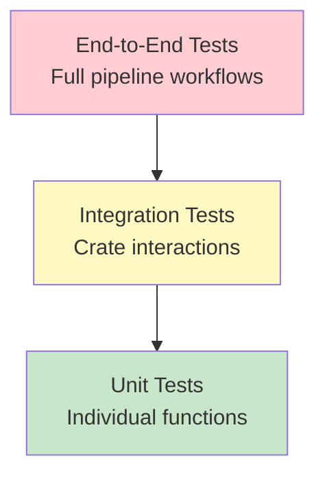

# Testing

Comprehensive testing guide for scan3data, covering unit tests, integration tests, and end-to-end tests.

## Test Strategy

scan3data follows a Test-Driven Development (TDD) approach with multiple test layers:



## Running Tests

### All Tests (Workspace)

```bash
# Run all tests in all crates
cargo test --workspace

# With output visible
cargo test --workspace -- --nocapture

# With specific test threads
cargo test --workspace -- --test-threads=1
```

### Crate-Specific Tests

```bash
# Test core_pipeline
cargo test -p core_pipeline

# Test llm_bridge
cargo test -p llm_bridge

# Test CLI
cargo test -p scan3data-cli

# Test server
cargo test -p scan3data-server
```

### Specific Test

```bash
# Run single test by name
cargo test test_grayscale_conversion

# Run tests matching pattern
cargo test ocr_

# Run tests in specific module
cargo test core_pipeline::ocr::tests
```

## Unit Tests

Located in each module with `#[cfg(test)]`:

### Example: core_pipeline/src/preprocess.rs

```rust
#[cfg(test)]
mod tests {
    use super::*;
    use image::{GrayImage, Luma};

    fn create_test_image() -> GrayImage {
        GrayImage::from_fn(100, 100, |x, y| {
            if x < 50 { Luma([0u8]) } else { Luma([255u8]) }
        })
    }

    #[test]
    fn test_grayscale_conversion() {
        let rgb = create_test_rgb_image();
        let gray = to_grayscale(&rgb);
        assert_eq!(gray.dimensions(), rgb.dimensions());
    }

    #[test]
    fn test_adaptive_threshold() {
        let gray = create_test_image();
        let binary = adaptive_threshold(&gray);

        // All pixels should be 0 or 255
        for pixel in binary.pixels() {
            assert!(pixel[0] == 0 || pixel[0] == 255);
        }
    }

    #[test]
    fn test_deskew_zero_angle() {
        let img = create_test_image();
        let deskewed = deskew(&img).unwrap();

        // Image should be unchanged for 0-degree skew
        assert_eq!(img.dimensions(), deskewed.dimensions());
    }
}
```

### Running Unit Tests

```bash
# Run all unit tests in core_pipeline
cargo test -p core_pipeline

# Run specific test
cargo test -p core_pipeline test_grayscale_conversion

# With output
cargo test -p core_pipeline -- --nocapture
```

## Integration Tests

Located in `crates/<crate>/tests/` directory:

### Example: core_pipeline/tests/ocr_pipeline.rs

```rust
use core_pipeline::*;
use std::path::PathBuf;

#[test]
fn test_full_preprocessing_pipeline() {
    let img = image::open("test-data/sample-listing.jpg")
        .expect("Test image not found");

    let preprocessed = preprocess_for_ocr(&img)
        .expect("Preprocessing failed");

    // Verify dimensions preserved
    assert_eq!(preprocessed.dimensions(), img.to_luma8().dimensions());

    // Verify binary output
    for pixel in preprocessed.pixels() {
        assert!(pixel[0] == 0 || pixel[0] == 255);
    }
}

#[test]
fn test_ocr_extraction() {
    let img = image::open("test-data/text-card.jpg").unwrap();
    let preprocessed = preprocess_for_ocr(&img).unwrap();
    let text = extract_text(&preprocessed).unwrap();

    // Verify text was extracted
    assert!(!text.is_empty());
    // Verify uppercase (IBM 1130 characteristic)
    assert_eq!(text, text.to_uppercase());
}
```

### Running Integration Tests

```bash
# Run all integration tests
cargo test --test '*'

# Run specific integration test file
cargo test --test ocr_pipeline
```

## End-to-End Tests

Located in workspace root `tests/` directory:

### Example: tests/cli_workflow.rs

```rust
use std::process::Command;
use tempfile::tempdir;

#[test]
fn test_ingest_analyze_export_workflow() {
    let temp = tempdir().unwrap();
    let scan_set = temp.path().join("scan_set");

    // Step 1: Ingest
    let output = Command::new("./target/release/scan3data")
        .args(&["ingest", "-i", "test-data", "-o", scan_set.to_str().unwrap()])
        .output()
        .expect("Failed to execute ingest");

    assert!(output.status.success());
    assert!(scan_set.join("artifacts.json").exists());

    // Step 2: Analyze
    let output = Command::new("./target/release/scan3data")
        .args(&["analyze", "-s", scan_set.to_str().unwrap()])
        .output()
        .expect("Failed to execute analyze");

    assert!(output.status.success());

    // Verify artifacts updated
    let artifacts = std::fs::read_to_string(scan_set.join("artifacts.json")).unwrap();
    assert!(artifacts.contains("content_text"));

    // Step 3: Export
    let output_file = temp.path().join("output.json");
    let output = Command::new("./target/release/scan3data")
        .args(&[
            "export",
            "-s", scan_set.to_str().unwrap(),
            "-o", output_file.to_str().unwrap()
        ])
        .output()
        .expect("Failed to execute export");

    assert!(output.status.success());
    assert!(output_file.exists());
}
```

## WASM Tests

For the Yew frontend, use `wasm-bindgen-test`:

### Example: yew_frontend/src/app.rs

```rust
#[cfg(test)]
mod tests {
    use super::*;
    use wasm_bindgen_test::*;

    wasm_bindgen_test_configure!(run_in_browser);

    #[wasm_bindgen_test]
    fn test_pipeline_data_default() {
        let data = PipelineData::default();
        assert!(data.original_image.is_none());
        assert!(data.cleaned_image.is_none());
        assert!(!data.validated);
    }

    #[wasm_bindgen_test]
    fn test_stage_transitions() {
        let stage = PipelineStage::Upload;
        assert_eq!(stage, PipelineStage::Upload);

        // Test transition
        let next_stage = PipelineStage::ImageCleaning;
        assert_ne!(stage, next_stage);
    }
}
```

### Running WASM Tests

```bash
# Install wasm-pack
cargo install wasm-pack

# Run tests in headless browser
wasm-pack test --headless --firefox crates/yew_frontend

# Or Chrome
wasm-pack test --headless --chrome crates/yew_frontend
```

## Test Data

### Creating Synthetic Test Data

```rust
// In test utilities
pub mod test_utils {
    use image::{GrayImage, Luma};

    pub fn create_checkerboard(width: u32, height: u32) -> GrayImage {
        GrayImage::from_fn(width, height, |x, y| {
            if (x + y) % 2 == 0 {
                Luma([0u8])
            } else {
                Luma([255u8])
            }
        })
    }

    pub fn create_text_image(text: &str) -> GrayImage {
        // Use imageproc to render text
        let mut img = GrayImage::new(800, 100);
        draw_text_mut(&mut img, Luma([0u8]), 10, 10, font, text);
        img
    }
}
```

### Using Real Test Data

Place test images in `test-data/` directory (gitignored):

```
test-data/
├── sample-listing.jpg      # Computer listing
├── text-card.jpg           # 80-column text card
├── object-card.jpg         # Binary object card
└── greenbar-listing.jpg    # Greenbar paper scan
```

**Note:** Test data is gitignored due to size. Download from project releases or create synthetic data.

## Coverage

### Install Coverage Tools

```bash
# Install cargo-tarpaulin
cargo install cargo-tarpaulin

# Or cargo-llvm-cov
cargo install cargo-llvm-cov
```

### Generate Coverage Report

```bash
# Using tarpaulin
cargo tarpaulin --workspace --out Html

# Using llvm-cov
cargo llvm-cov --workspace --html

# Output: tarpaulin-report.html or target/llvm-cov/html/index.html
```

### Coverage Goals

- **Unit tests:** ≥ 80% coverage per crate
- **Integration tests:** All public APIs covered
- **End-to-end tests:** All CLI commands covered

## Quality Gates

Before every commit, run:

```bash
# 1. Run all tests
cargo test --workspace

# 2. Check clippy (zero warnings)
cargo clippy --all-targets --all-features -- -D warnings

# 3. Check formatting
cargo fmt --check

# 4. Run markdown linter (if docs changed)
markdown-checker -f "**/*.md"
```

**All must pass before committing.**

## Test-Driven Development (TDD)

### Red/Green/Refactor Cycle

1. **RED:** Write a failing test

```rust
#[test]
fn test_new_feature() {
    let result = new_feature(input);
    assert_eq!(result, expected);  // FAILS - function doesn't exist yet
}
```

2. **GREEN:** Write minimal code to pass

```rust
pub fn new_feature(input: Type) -> Type {
    expected  // Hardcoded to pass test
}
```

3. **REFACTOR:** Improve implementation

```rust
pub fn new_feature(input: Type) -> Type {
    // Proper implementation
    input.transform()
}
```

4. **REPEAT:** Add more tests, refine implementation

## Continuous Integration

### GitHub Actions Example

```yaml
name: Tests

on: [push, pull_request]

jobs:
  test:
    runs-on: ubuntu-latest
    steps:
      - uses: actions/checkout@v3
      - uses: actions-rs/toolchain@v1
        with:
          toolchain: stable
      - name: Install dependencies
        run: |
          sudo apt-get install tesseract-ocr libtesseract-dev
      - name: Run tests
        run: cargo test --workspace
      - name: Run clippy
        run: cargo clippy --all-targets --all-features -- -D warnings
      - name: Check formatting
        run: cargo fmt --check
```

## Benchmarking

### Using Criterion

```rust
// benches/ocr_benchmark.rs
use criterion::{black_box, criterion_group, criterion_main, Criterion};
use core_pipeline::*;

fn benchmark_preprocessing(c: &mut Criterion) {
    let img = load_test_image();

    c.bench_function("preprocess_for_ocr", |b| {
        b.iter(|| preprocess_for_ocr(black_box(&img)))
    });
}

criterion_group!(benches, benchmark_preprocessing);
criterion_main!(benches);
```

```bash
# Run benchmarks
cargo bench
```

## Related Pages

- [Building](Building) - Building before testing
- [Contributing](Contributing) - Quality standards and workflow
- [Core Pipeline](Core-Pipeline) - Core component tests

---

**Last Updated:** 2025-11-16
