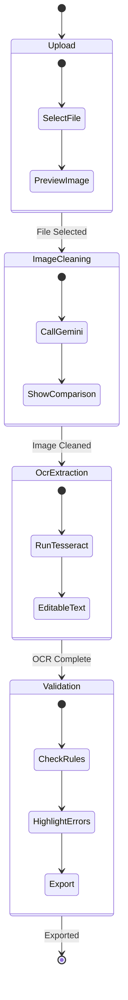

# Web UI (Yew Frontend)

The **yew_frontend** crate implements a browser-based UI using Yew (Rust compiled to WebAssembly). It features a 4-stage pipeline visualization for interactive OCR processing.

## Overview

**Crate Name:** `yew_frontend`
**Type:** Library (compiles to WASM)
**Target:** wasm32-unknown-unknown
**Dependencies:** yew, wasm-bindgen, web-sys, gloo, gloo-net
**Build Tool:** Trunk

## 4-Stage Pipeline



## Component Structure

```
yew_frontend/src/
├── lib.rs              # WASM entry point
├── app.rs              # Main App component
└── components/
    ├── mod.rs          # Component exports
    ├── pipeline.rs     # Pipeline visualization
    └── upload.rs       # File upload component
```

## Components

### App Component

```rust
#[function_component(App)]
pub fn app() -> Html {
    let pipeline_data = use_state(PipelineData::default);
    let current_stage = use_state(|| PipelineStage::Upload);

    html! {
        <div class="container">
            <h1>{"scan3data - IBM 1130 OCR Pipeline"}</h1>
            <Pipeline
                data={(*pipeline_data).clone()}
                current_stage={*current_stage}
                on_upload={on_upload_callback}
                on_clean={on_clean_callback}
                on_ocr={on_ocr_callback}
                on_validate={on_validate_callback}
            />
        </div>
    }
}
```

### Pipeline Component

```rust
#[derive(Properties, PartialEq, Clone)]
pub struct PipelineProps {
    pub data: PipelineData,
    pub current_stage: PipelineStage,
    pub on_upload: Callback<Vec<u8>>,
    pub on_clean: Callback<()>,
    pub on_ocr: Callback<()>,
    pub on_validate: Callback<()>,
}

#[function_component(Pipeline)]
pub fn pipeline(props: &PipelineProps) -> Html {
    html! {
        <div class="pipeline">
            <StageIndicator current={props.current_stage} />

            {match props.current_stage {
                PipelineStage::Upload => html! {
                    <UploadStage on_upload={props.on_upload.clone()} />
                },
                PipelineStage::ImageCleaning => html! {
                    <CleaningStage
                        original={props.data.original_image.clone()}
                        cleaned={props.data.cleaned_image.clone()}
                        on_clean={props.on_clean.clone()}
                    />
                },
                PipelineStage::OcrExtraction => html! {
                    <OcrStage
                        text={props.data.raw_ocr_text.clone()}
                        on_ocr={props.on_ocr.clone()}
                    />
                },
                PipelineStage::Validation => html! {
                    <ValidationStage
                        text={props.data.raw_ocr_text.clone()}
                        on_validate={props.on_validate.clone()}
                    />
                },
            }}
        </div>
    }
}
```

### Upload Component

```rust
#[function_component(UploadStage)]
pub fn upload_stage(props: &UploadProps) -> Html {
    let on_file_change = {
        let on_upload = props.on_upload.clone();
        Callback::from(move |e: Event| {
            let input: HtmlInputElement = e.target_unchecked_into();
            if let Some(files) = input.files() {
                if let Some(file) = files.get(0) {
                    let on_upload = on_upload.clone();
                    wasm_bindgen_futures::spawn_local(async move {
                        let bytes = read_file_as_bytes(&file).await;
                        on_upload.emit(bytes);
                    });
                }
            }
        })
    };

    html! {
        <div class="upload-stage">
            <h2>{"1. Upload Image"}</h2>
            <input
                type="file"
                accept="image/*"
                onchange={on_file_change}
            />
        </div>
    }
}
```

## API Communication

### Calling Backend APIs

```rust
use gloo_net::http::Request;

async fn clean_image(image_data: &str) -> Result<String, String> {
    let request_body = serde_json::json!({
        "image_data": image_data
    });

    let response = Request::post("http://localhost:7214/api/clean-image")
        .json(&request_body)
        .map_err(|e| e.to_string())?
        .send()
        .await
        .map_err(|e| e.to_string())?;

    if !response.ok() {
        return Err(format!("HTTP {}: {}", response.status(), response.status_text()));
    }

    let json: serde_json::Value = response
        .json()
        .await
        .map_err(|e| e.to_string())?;

    json.get("cleaned_image_data")
        .and_then(|v| v.as_str())
        .map(|s| s.to_string())
        .ok_or_else(|| "Missing cleaned_image_data field".to_string())
}
```

### Error Handling

```rust
use gloo::console;

match clean_image(&base64_data).await {
    Ok(cleaned_base64) => {
        // Update UI with cleaned image
        let cleaned_url = format!("data:image/jpeg;base64,{}", cleaned_base64);
        set_cleaned_image(Some(cleaned_url));
    }
    Err(e) => {
        // Log error and show toast
        console::error!("Failed to clean image:", e);
        show_error_toast(&format!("Image cleaning failed: {}", e));
    }
}
```

## Styling

### CSS Organization

```css
/* index.html includes: */
<style>
.container {
    max-width: 1200px;
    margin: 0 auto;
    padding: 20px;
}

.pipeline {
    display: flex;
    flex-direction: column;
    gap: 20px;
}

.stage-indicator {
    display: flex;
    justify-content: space-between;
    margin-bottom: 30px;
}

.stage {
    flex: 1;
    padding: 10px;
    text-align: center;
    background: #f0f0f0;
    border-radius: 5px;
}

.stage.active {
    background: #4caf50;
    color: white;
}

.image-comparison {
    display: grid;
    grid-template-columns: 1fr 1fr;
    gap: 20px;
}

.image-box {
    border: 1px solid #ccc;
    border-radius: 5px;
    padding: 10px;
}

.image-box img {
    max-width: 100%;
    height: auto;
}

textarea.ocr-text {
    width: 100%;
    min-height: 400px;
    font-family: 'Courier New', monospace;
    font-size: 14px;
}
</style>
```

## Build Process

### Trunk Configuration

```toml
# Trunk.toml
[build]
target = "index.html"
dist = "dist"

[watch]
ignore = ["dist"]

[serve]
port = 8080
address = "127.0.0.1"
```

### Building

```bash
# Development build with watch
trunk serve

# Production build
trunk build --release

# Output: dist/
```

### Deployment

```bash
# Copy dist to server's static directory
cp -r dist/* ../server/static/
```

## State Management

### Pipeline Data

```rust
#[derive(Clone, Default, PartialEq)]
pub struct PipelineData {
    pub original_image: Option<String>,  // data:image/jpeg;base64,...
    pub cleaned_image: Option<String>,   // data:image/jpeg;base64,...
    pub raw_ocr_text: Option<String>,
    pub validated: bool,
}

#[derive(Clone, Copy, PartialEq)]
pub enum PipelineStage {
    Upload,
    ImageCleaning,
    OcrExtraction,
    Validation,
}
```

### State Transitions

```rust
// Upload → ImageCleaning
let on_upload = {
    let pipeline_data = pipeline_data.clone();
    let current_stage = current_stage.clone();
    Callback::from(move |image_bytes: Vec<u8>| {
        let base64 = base64::encode(&image_bytes);
        let data_url = format!("data:image/jpeg;base64,{}", base64);

        let mut data = (*pipeline_data).clone();
        data.original_image = Some(data_url);
        pipeline_data.set(data);
        current_stage.set(PipelineStage::ImageCleaning);
    })
};

// ImageCleaning → OcrExtraction
let on_clean = {
    let current_stage = current_stage.clone();
    Callback::from(move |_| {
        current_stage.set(PipelineStage::OcrExtraction);
    })
};
```

## Testing

### WASM Tests

```rust
#[cfg(test)]
mod tests {
    use super::*;
    use wasm_bindgen_test::*;

    wasm_bindgen_test_configure!(run_in_browser);

    #[wasm_bindgen_test]
    fn test_pipeline_data_default() {
        let data = PipelineData::default();
        assert!(data.original_image.is_none());
        assert!(data.cleaned_image.is_none());
        assert!(!data.validated);
    }

    #[wasm_bindgen_test]
    fn test_stage_progression() {
        let stage = PipelineStage::Upload;
        assert_eq!(stage, PipelineStage::Upload);
    }
}
```

### Running WASM Tests

```bash
# Install wasm-pack
cargo install wasm-pack

# Run tests in headless browser
wasm-pack test --headless --firefox crates/yew_frontend
```

## Future Enhancements

### Planned Features

1. **Batch Processing**
   - Upload multiple images
   - Process in parallel
   - Progress bar for batch operations

2. **Drag-and-Drop Ordering**
   - Reorder pages/cards
   - Visual feedback during drag
   - Save custom ordering

3. **Export Functionality**
   - Download OCR results as text
   - Download as emulator-ready JSON
   - Copy to clipboard

4. **Advanced Validation**
   - Real-time error highlighting
   - Suggestion tooltips
   - Undo/redo for manual edits

## Related Pages

- [Architecture](Architecture) - Overall system design
- [REST API](REST-API) - Backend endpoints used by UI
- [Data Flow](Data-Flow) - UI interaction sequences
- [Building](Building) - Build instructions

---

**Last Updated:** 2025-11-16
